# RelatoSeg: uma arquitetura de referência distribuída para orquestração de agentes de IA via MCP aplicada à geração automatizada de relatórios de sinistros de seguros

*Projeto Integrado — Relatório Técnico*

**Sistema:** `RelatoSeg — Geração Automatizada de Relatórios de Análise de Sinistros` *(instância do domínio de seguros; a arquitetura subjacente é apresentada como referência arquitetural multi-domínio — podendo servir de inspiração, base ou template para outros sistemas, além de admitir extensão do próprio RelatoSeg a novos domínios de negócio via novo MCP Server, sem alterar o MCP Host — RF15/RNF02)*
**Domínio aplicado:** `Análise de Sinistros de Seguros`
**Aluno(s):** José Ribamar Bacelar Netto
**Belo Horizonte, agosto de 2026**

> Estrutura baseada no template oficial (`doc/puc/Template RelatorioTecnico ASD simpl.docx`) e no
> Regulamento do Projeto Integrado — pós ASD 2025 (`doc/puc/Regulamento do Projeto Integrado - pós ASD 2025.pdf`).
> Este documento segue as **duas etapas**.

> **Repositório do projeto:** o código-fonte, os modelos C4 (Structurizr) e os diagramas de componentes (PlantUML) usados neste relatório estão versionados em [github.com/bacelarnetto/tcc-puc-minas-arquitetura-software](https://github.com/bacelarnetto/tcc-puc-minas-arquitetura-software) — incluindo os artefatos editáveis (`doc/c4/`, `doc/uml/`) e o próprio relatório publicado via [docsify](https://docsify.js.org/) (`doc/relatorio/`).

---

## 1. Introdução

O presente relatório técnico apresenta o projeto da solução RelatoSeg, desenvolvida para otimizar e automatizar o fluxo de processamento e regulação de sinistros no setor securitário. Por meio da integração de modelos de linguagem e arquitetura distribuída baseada no protocolo MCP, o sistema busca consolidar dados heterogêneos e acelerar a tomada de decisão, garantindo eficiência operacional e conformidade com os prazos regulatórios do setor.

### Contextualização

Seguradoras processam diariamente um grande volume de sinistros, cada um exigindo a análise cruzada de informações heterogêneas: fotos do dano enviadas pela segurada, laudos e documentos de peritos, dados cadastrais e histórico da apólice em sistemas legados, e regras de cobertura específicas de cada produto. A regulação desses sinistros está sujeita a prazo regulatório: a Superintendência de Seguros Privados (SUSEP), pela Circular SUSEP nº 621/2021, estabelece prazo de até 30 dias corridos (prorrogável em casos específicos) entre a entrega da documentação pela segurada e a conclusão da regulação, sob pena de atualização monetária e juros de mora (SUSEP, 2021; CONJUR, 2024). Historicamente, essa análise é conduzida manualmente por reguladores de sinistro, que precisam consultar múltiplos sistemas e documentos para compor um parecer dentro desse prazo. Esse cenário de pressão por agilidade coincide com uma adoção crescente de inteligência artificial no setor: pesquisa da CNseg (Confederação Nacional das Seguradoras) indica que 80% das seguradoras brasileiras já implantaram alguma solução de IA, apontando a integração entre sistemas legados como a principal barreira relatada, citada por 69% das respondentes (MOBILE TIME, 2026). Com a maturidade recente de agentes de IA (LLMs) capazes de interpretar dados não estruturados (imagens, documentos) e operar ferramentas (*tools*) via protocolos padronizados como o **MCP (Model Context Protocol)** (ANTHROPIC, 2024), abre-se a possibilidade de automatizar parte relevante desse processo de forma estruturada e auditável — endereçando justamente essa barreira de integração entre sistemas heterogêneos.

### Problema

A geração do relatório de análise de um sinistro, hoje, depende de um processo majoritariamente manual: o regulador precisa acessar individualmente o sistema de apólices, o repositório de documentos/fotos enviados pela segurada e, eventualmente, sistemas de terceiros (ex. tabelas de referência de peças/serviços), para então redigir um parecer consolidado. Isso torna o tempo de resposta ao segurado longo e sujeito a inconsistência entre pareceres de reguladores diferentes, além de dificultar a rastreabilidade de quais evidências embasaram cada decisão. Automatizar esse fluxo especificamente para sinistros, por sua vez, não resolve o problema de fundo: outras áreas da seguradora (ex. auditoria de compliance, ouvidoria) enfrentam a mesma necessidade de cruzar dados heterogêneos e gerar relatórios, sem uma arquitetura compartilhada que evite reconstruir o mesmo pipeline do zero.

### Motivação

Padronizar esse pipeline em uma arquitetura distribuída reutilizável reduz o esforço de engenharia necessário para automatizar a geração de relatórios em uma nova área da seguradora — bastando implementar sua própria API de ferramentas de domínio (MCP Server), sem recriar o restante do fluxo (orquestração, armazenamento, consolidação, geração de documento e notificação). No caso da análise de sinistros, isso significa reduzir o tempo de regulação, padronizar a qualidade dos pareceres e manter rastreabilidade completa de quais evidências (fotos, laudos, dados da apólice) embasaram cada relatório gerado — um requisito relevante inclusive do ponto de vista regulatório (ex. SUSEP).

### Objetivos
- **Objetivo geral:** Propor uma arquitetura distribuída de referência, baseada na orquestração de agentes de IA (LLM) via protocolo MCP, capaz de automatizar a geração de relatórios analíticos a partir de dados corporativos heterogêneos, de forma reutilizável entre diferentes áreas de negócio — demonstrada no domínio de **análise de sinistros de seguros**.
- **Objetivos específicos:**
  1. Definir a macroarquitetura (modelo **C4** — contexto, container e componentes; BROWN, [s.d.]) do pipeline de geração automatizada de relatórios de sinistro, desde a solicitação de regulação até a notificação do parecer.
  2. Especificar os mecanismos de integração entre o motor de orquestração da pipeline, a plataforma de orquestração de agentes (MCP Host) e a API de ferramentas de domínio (MCP Server / Tools API) que consulta apólice, sinistro e documentos.
  3. Avaliar a arquitetura proposta quanto a segurança, disponibilidade, desempenho e escalabilidade, rastreabilidade, extensibilidade para novos domínios de negócio e usabilidade/disponibilidade offline (mobile), segundo o método ATAM.

---

## 2. Especificação Arquitetural da Solução

Esta seção apresenta a especificação arquitetural da solução RelatoSeg, detalhando as restrições técnicas, os requisitos funcionais e não funcionais que norteiam o projeto, além dos mecanismos arquiteturais adotados para garantir a integração, escalabilidade e segurança na geração automatizada de relatórios de análise de sinistros.

### 2.1 Restrições Arquiteturais

As restrições arquiteturais definem as limitações técnicas, contratuais, normativas ou operacionais que impõem fronteiras ao design da solução RelatoSeg. A Tabela apresenta as restrições mandatórias estabelecidas para o desenvolvimento e a infraestrutura do sistema.

*Tabela — Restrições arquiteturais*

| ID | Restrição |
| --- | --- |
| R1 | A comunicação entre a plataforma de orquestração de agentes (MCP Host) e as APIs de ferramentas de domínio deve seguir o protocolo **MCP (Model Context Protocol)**. |
| R2 | Os dados brutos do sinistro (documentos, imagens, respostas de agentes) devem ser armazenados fora de infraestrutura on-premise, já que a seguradora não mantém datacenter próprio para novos projetos — restringindo o armazenamento intermediário a serviços de *object storage* em nuvem. |
| R3 | Os dados estruturados de apólice e sinistro já são replicados para o *data warehouse* corporativo (ex.: BigQuery) mantido pela área de dados da seguradora, sem acesso direto aos bancos operacionais dos sistemas legados — restringindo a consulta estruturada a essa camada analítica. |
| R4 | A notificação — de erro em qualquer etapa do pipeline, ou de sucesso ao final do processamento — deve ser assíncrona, via mecanismo de mensageria *pub/sub*. |
| R5 | Dados pessoais e de sinistro (fotos, laudos, dados da segurada) tratados pela plataforma devem atender a requisitos de proteção de dados (Lei Geral de Proteção de Dados — LGPD) e às normas do órgão regulador do setor (SUSEP). |

### 2.2 Requisitos Funcionais

| ID | Descrição Resumida | Dificuldade (B/M/A) | Prioridade (B/M/A) |
| --- | --- | --- | --- |
| RF01 | Permitir que o regulador solicite a análise automatizada de um sinistro registrado, via Workflow/BPM (Business Process Management) existente | M | A |
| RF02 | Permitir que a segurada envie, via aplicativo mobile ou web portal, fotos e informações do dano diretamente para a plataforma, disparando a análise | A | A |
| RF03 | Registrar o pedido de análise com identificador único de correlação ao sinistro, independentemente da origem (regulador ou segurada) | B | A |
| RF04 | Orquestrar a execução dos agentes de IA (MCP Host) a partir do pedido registrado | A | A |
| RF05 | Permitir, via **Agent Console** dedicado (app própria, separada do Web Console operacional), a criação e configuração de agentes — prompt e modelo de LLM associado — e o cadastro de novos MCP Servers, restrito a funcionários técnicos/de negócio da seguradora (administrador de plataforma) | M | M |
| RF06 | Expor, via MCP Server (Tools API), as ferramentas de consulta a apólice, sinistro e documentos | A | A |
| RF07 | Consultar dados estruturados da apólice e do sinistro (*data warehouse*) a partir das tools | M | A |
| RF08 | Coletar e armazenar fotos do dano e laudos periciais, incluindo geolocalização e timestamp capturados pelo app mobile | M | A |
| RF09 | Consolidar os dados brutos coletados em um metadado padronizado do parecer de sinistro | A | A |
| RF10 | Gerar o documento final do parecer a partir do metadado consolidado | M | A |
| RF11 | Publicar o resultado do processamento (sucesso) em tópico de notificação, com link do documento, disparando notificação ativa por e-mail (regulador/corretor) e push mobile (segurada) | M | A |
| RF12 | Publicar erros ocorridos em qualquer etapa do pipeline no mesmo mecanismo de notificação | M | M |
| RF13 | Permitir que apenas a área solicitante consuma a notificação/relatório correspondente (filtro por correlação) | M | A |
| RF14 | Disponibilizar, via Web Console, o status e o histórico de cada solicitação de análise para regulador e corretor de seguros | M | M |
| RF15 | Permitir o cadastro de um novo MCP Server (nova área de negócio, além de sinistros) sem alterar o MCP Host | A | M |

### 2.3 Requisitos Não-funcionais

Os requisitos não funcionais estabelecem os critérios de qualidade, atributos de desempenho, diretrizes de segurança e restrições operacionais que sustentam a arquitetura da plataforma RelatoSeg. A Tabela descreve as métricas e padrões mandatórios garantidos pela solução.

*Tabela — Requisitos não funcionais*

| ID | Descrição | Prioridade (B/M/A) |
| --- | --- | --- |
| RNF01 | **Segurança/Privacidade:** dados sensíveis em trânsito e em repouso devem ser criptografados; autenticação via OAuth2/OIDC (Keycloak), com o API Gateway validando o token e aplicando controle de acesso baseado em papel (RBAC — *Role-Based Access Control*) para segurada, regulador, corretor e administrador; acesso à Tools API deve exigir autenticação por serviço e estar sujeito a rate limiting no API Gateway e na própria Tools API | A |
| RNF02 | **Extensibilidade:** deve ser possível integrar um novo MCP Server (novo domínio de negócio) em até **10 dias-homem** (implementação das tools + testes, seguindo o padrão estabelecido), sem alteração no MCP Host | A |
| RNF03 | **Disponibilidade:** a plataforma deve operar com disponibilidade de 99,9% em horário comercial | M |
| RNF04 | **Desempenho e Escalabilidade:** para um sinistro de volume típico (até 15 fotos e laudo pericial de até 10 páginas), o tempo entre a solicitação do parecer e a notificação final não deve ultrapassar **10 minutos (p95)**; a plataforma deve suportar pelo menos **50 solicitações concorrentes** sem degradação, inclusive picos de envio de fotos via app mobile | A |
| RNF05 | **Rastreabilidade:** todo parecer gerado deve ser auditável de ponta a ponta (quem solicitou, quais fontes/evidências consultadas, quando), inclusive as submissões feitas via app mobile | M |
| RNF06 | **Usabilidade e Disponibilidade Offline (mobile):** o aplicativo da segurada deve permitir a captura de fotos do sinistro mesmo sem conectividade, sincronizando automaticamente quando a conexão for restabelecida | M |

> **Nota sobre RNF03 (disponibilidade):** o valor de 99,9%/mês (~43min de indisponibilidade tolerada) é sustentado pela topologia definida em 2.4 — cluster **Kubernetes (GKE)** multi-zona, com múltiplas réplicas de cada componente de aplicação e *rolling updates* sem downtime, combinado a serviços gerenciados do GCP (**Cloud SQL**, **Memorystore**, **Pub/Sub**) que já oferecem SLA de alta disponibilidade próprio, tirando da plataforma a responsabilidade de operar HA para os componentes com estado. Esse trade-off (maior complexidade/custo operacional × maior disponibilidade, em troca da simplicidade do nó único usado só em desenvolvimento/testes locais via Docker Compose) é revisitado na Avaliação Arquitetural (seção 4).

> **Nota sobre RNF04 (desempenho — ponto de atenção da latência de IA):** o alvo de 10 min (p95) depende não só do processamento interno da plataforma, mas do tempo de resposta do **provedor de LLM** contratado — uma dependência externa cuja latência (fila do provedor, *rate limiting*, variação natural do tempo de inferência do modelo, e o próprio tamanho da cadeia de raciocínio gerada) está fora do controle direto da arquitetura, na mesma fronteira já declarada para disponibilidade (RNF03, nota acima). O `LLM Provider Adapter` (seção 2.4) mitiga parcialmente esse risco ao permitir *model tiering* — um modelo mais rápido/previsível nas etapas menos sensíveis à qualidade do raciocínio —, mas não elimina a variabilidade de latência de um serviço terceiro. Esse ponto é revisitado como risco explícito na Avaliação Arquitetural (seção 4, Cenário RNF04).

### 2.4 Mecanismos Arquiteturais

Os mecanismos arquiteturais representam as decisões de design e escolhas tecnológicas adotadas para atender aos requisitos funcionais, não funcionais e restrições do sistema RelatoSeg. A estrutura mapeia as necessidades identificadas na fase de Análise para os padrões arquiteturais de Design e suas respectivas escolhas de Implementação na infraestrutura de nuvem.

*Tabela — Mecanismos arquiteturais*

| Análise | Design | Implementação |
| --- | --- | --- |
| Persistência (dados estruturados, fonte externa) | *Data warehouse* na nuvem | BigQuery (GCP) |
| Persistência (dados não estruturados) | *Object storage* | Google Cloud Storage (GCS) |
| Persistência (estado operacional do pipeline) | Banco relacional — uma única instância, com um schema por dono: **Temporal Server** (histórico de execução dos workflows/activities, gerenciado automaticamente pelo próprio Temporal) e **Init Worker** (registro da solicitação, step 1) — mesmo domínio de execução (Init Worker é a própria *activity* de step 1 orquestrada pelo Temporal); a API de Sinistros não toca nesta base, preservando *Database per Service* | Cloud SQL for PostgreSQL |
| Persistência (configuração de agentes/LLM) | Banco relacional dedicado ao **MCP Host** (Prompt Config Store — prompts, modelos, **chaves de API dos provedores de LLM**, RF05) — instância própria, isolada da base de execução do pipeline: domínio diferente (configuração de agentes vs. execução de workflow) e dado sensível (credencial), mesmo raciocínio já aplicado à persistência do Keycloak | Cloud SQL for PostgreSQL (instância separada) |
| Persistência (modelo de leitura / view) | Banco relacional, uso exclusivo da API de Sinistros — princípio *Database per Service*: cada serviço dono da sua base, dados duplicados entre bases quando necessário, em troca de desacoplamento | Cloud SQL for PostgreSQL (instância separada) |
| Cache de leitura | Cache em memória, gerenciado | Memorystore for Redis |
| Autenticação/Autorização (IAM) | OAuth2 (HARDT, 2012)/OIDC — dois realms: interno (federado ao SSO corporativo já existente na seguradora) e externo (cadastro próprio da segurada); Gateway valida token via JWKS (*JSON Web Key Set*), RBAC aplicado por *claims* de papel | Keycloak (self-hosted, containerizado no GKE) |
| Persistência (IAM) | Banco relacional dedicado ao Keycloak — instância própria, isolada da base operacional, por ser dado sensível (credenciais) que pede segregação extra | Cloud SQL for PostgreSQL (instância separada) |
| Restrição de acesso de rede (IAM — Agent Console) | Controle de acesso na borda por identidade (zero-trust), adicional à autenticação Keycloak/OIDC — restringe quem sequer alcança a aplicação, não só quem consegue logar, dado o *blast radius* de configurar agentes/prompts/modelos e cadastrar novos MCP Servers | Google Cloud Identity-Aware Proxy (IAP) |
| Orquestração da pipeline (steps 1-5) | Execução durável / retries automáticos / dedup por Workflow ID | Temporal.io (self-hosted, containerizado no GKE) |
| Orquestração de agentes | Protocolo MCP — Spring MCP Client (Host) consome tools via `@McpTool`, transporte HTTP/SSE/Stdio | Spring AI (MCP Client/Server starters) |
| Integração com provedor de LLM | *Adapter* (`LLMProviderAdapter`) sobre o `ChatClient` do Spring AI, isolando o Agent Orchestrator do provedor específico — permite trocar de modelo/provedor sem alterar o MCP Host | Spring AI `ChatClient` + provedor de LLM contratado (ex. OpenAI, Anthropic, Gemini) |
| Borda de API (entrada de negócio) | API Gateway único — autenticação, rate limiting, roteamento; sem BFF (o Mobile App é o único canal com requisito distinto — RNF06, offline-first —, mas ainda opera sobre o mesmo contrato simples de disparo/consulta de status dos demais, sem exigir payload ou agregação diferente; não há hoje lógica condicional por canal que justifique a camada extra) | Spring Cloud Gateway (mesma stack Spring/Java do resto do back end; integra nativamente com Spring Security para autenticação, sem introduzir mais uma linguagem/tecnologia no projeto) |
| Back end (Tools API / MCP Service) | API REST + Spring MCP Service (Server), regras de negócio e segurança/rate limiting sobre BigQuery/APIs | Spring Boot 3.x + Spring MVC (Java 21 LTS) |
| Front end (Web Console — uso interno) | Single Page Application; compartilhada entre regulador e corretor de seguros (acompanhamento de status/histórico) | React (TypeScript) |
| Front end (Web Portal — uso externo) | Single Page Application; aplicação separada do Web Console — fronteira externo/interno (ver justificativa abaixo) | React (TypeScript) |
| Front end (Agent Console — uso interno, técnico) | Single Page Application dedicada ao administrador de plataforma (funcionário técnico/de negócio da seguradora); criação/configuração de agentes (prompt, modelo de LLM) e cadastro de MCP Servers — separada do Web Console (ver justificativa abaixo) | React (TypeScript) |
| Mobile (App da Segurada) | App multiplataforma com suporte offline-first | React Native (TypeScript) |
| Notificação ativa (push/e-mail) | **API de Notificação** própria — container dedicado, reutilizável por outros domínios de negócio (RF15), consumidor independente do evento final: e-mail para regulador/corretor, push mobile para a segurada | Spring Boot + SendGrid (e-mail) + OneSignal (push) |
| Mensageria (notificação externa) | Tópico com duas *subscriptions* independentes (API de Sinistros e API de Notificação), cada uma recebendo cópia completa da mensagem publicada — mesmo comportamento de *fanout*, sem operar um broker próprio | Google Cloud Pub/Sub |
| Geração de documento | Integração com serviço de documentos | Google Drive API |
| Log do sistema | Log estruturado centralizado (emissão / coleta / armazenamento / visualização) | SLF4J/Logback (emissão) + Promtail (coleta) + Loki (armazenamento) + Grafana (dashboards) |
| Teste de Software | Unitário / integração / contrato / *end-to-end* | JUnit 5 + Mockito (back end); `temporal-testing` (Temporal Test Server em memória, para testes de workflow sem subir o Temporal Server completo); Testcontainers (Postgres + Redis + **emulador Google Cloud Pub/Sub**, em testes de integração); Jest + Testing Library (React/React Native); testes *end-to-end* do pipeline completo (disparo → notificação, incluindo caminho de erro do RF12) rodando contra o Docker Compose de desenvolvimento (componentes internos da plataforma, sem *mocks*) combinado ao **ambiente de homologação GCP** para Provedor de LLM e Google Drive (pasta de teste dedicada) — mesmo critério de homologação já usado para Storage/BigQuery (nota abaixo) |
| Deploy | Containerização + orquestração + CI/CD | **Kubernetes (GKE — Google Kubernetes Engine)** em produção; **Docker Compose** para desenvolvimento e testes locais (Temporal Server, Postgres, Redis, Keycloak e emulador Pub/Sub containerizados — ver nota abaixo sobre Storage/BigQuery); GitHub Actions (build/test/publish de imagens, deploy via Helm/kubectl) |

> **Decisões de stack consolidadas:** a plataforma adota o **Google Cloud Platform (GCP)** como provedor único de nuvem — decisão que atende à restrição R2 (dados fora de infraestrutura on-premise) sem fragmentar operação, *billing* e superfície de segurança entre múltiplos provedores; essa escolha sustenta as demais decisões de stack gerenciado descritas a seguir. Optou-se por **Temporal.io** (TEMPORAL TECHNOLOGIES, [s.d.]) como motor de orquestração da pipeline interna por oferecer execução durável com retries automáticos e **deduplicação nativa via Workflow ID** — dispensando um broker de mensageria entre os steps internos e uma solução própria de idempotência (ex. Redis com chave TTL) só para esse fim. O Temporal Server persiste seu estado na **Base do Pipeline** (Cloud SQL for PostgreSQL, compartilhada em schema separado com o Init Worker — suporte nativo do Temporal a Postgres, sem necessidade de Cassandra), simplificando a infraestrutura. Ao todo, a plataforma usa **quatro instâncias de Cloud SQL for PostgreSQL** (Base do Pipeline, Base do Prompt Config Store, Base de Sinistros e base do Keycloak), cada uma isolada por domínio ou por sensibilidade do dado (ver seção 2.4). Para a notificação externa final (Notifier → consumidores), optou-se pelo **Google Cloud Pub/Sub** em vez de um broker self-hosted: um único tópico com duas *subscriptions* independentes (API de Sinistros e API de Notificação), cada uma recebendo cópia completa de toda mensagem publicada — o mesmo comportamento de *fanout* que uma exchange RabbitMQ ofereceria, sem o ônus operacional de manter um broker (patching, HA, backup) por conta da plataforma. O filtro por área solicitante (RF13) continua não sendo feito pelo Pub/Sub; é aplicado na lógica de cada consumidor, a partir do `sinistro_id`/correlação presente no payload da mensagem. O **Memorystore for Redis** permanece na arquitetura com papel reduzido: cache de leitura para dados de apólice/sinistro consultados com frequência pela Tools API, reduzindo latência e custo de chamadas repetidas ao BigQuery/sistema legado. Para o estado operacional da plataforma (registro de solicitações, status, histórico consumido pelo Web Console) foi definido um banco relacional dedicado (**Cloud SQL for PostgreSQL**), já que o BigQuery — sendo um *data warehouse* analítico — não é adequado para carga transacional. Web Console e Mobile App foram unificados sob **React / React Native**, compartilhando linguagem (TypeScript) e padrões de componente entre as duas frentes. Em produção, todo o stack de aplicação (apps, API Gateway, Keycloak, Temporal Server) roda em **Kubernetes (GKE — Google Kubernetes Engine)**, com **Cloud SQL**, **Memorystore** e **Pub/Sub** como serviços gerenciados — dispensando a operação manual de alta disponibilidade para os componentes com estado (bancos, cache, mensageria), o principal ganho de escalabilidade/disponibilidade da topologia (ver nota do RNF03 acima).

> **Nota sobre o ambiente de desenvolvimento local:** um ponto de atenção da arquitetura é não deixar o time dependente de infraestrutura GCP real (custo, latência, credenciais) só para rodar e testar a plataforma no dia a dia — em especial a orquestração via **Temporal.io**, que concentra a lógica mais sensível a bug (retries, dedup, *activities*). Por isso o Docker Compose de desenvolvimento reproduz localmente, com fidelidade real (mesmo software, não simulação), tudo que tem uma contrapartida open-source containerizável:
>
> - **Temporal Server** (imagem oficial `temporal.io/auto-setup`, com seu próprio schema de histórico) — permite reproduzir localmente o comportamento real de execução durável, retries e deduplicação por Workflow ID, sem depender de conta GCP;
> - **PostgreSQL** e **Redis** — Cloud SQL for PostgreSQL e Memorystore for Redis são apenas hospedagem gerenciada dos bancos open-source correspondentes, falando o protocolo padrão de cada um (wire protocol do Postgres, RESP do Redis); um container `postgres`/`redis` comum já é 100% compatível — a aplicação não distingue se fala com a instância gerenciada ou com o container local, além de host/porta de conexão;
> - **Keycloak** e **Grafana/Loki/Promtail** — mesmas imagens self-hosted usadas como referência para o comportamento em produção;
> - **Pub/Sub** — via **emulador oficial do Google** (`gcloud-pubsub-emulator`), não um container Pub/Sub genérico: por expor uma API proprietária (gRPC/REST) sem equivalente open-source que fale o mesmo protocolo, é o único componente desta lista que precisa de um *emulador* (e não do software real) para ser reproduzido localmente.
>
> Já **Cloud Storage (GCS)** e **BigQuery** não têm uma opção de simulação local oficial com fidelidade equivalente — BigQuery, em particular, não possui emulador mantido pelo Google, e o próprio dado consultado (*data warehouse* corporativo da seguradora) não existe fora do GCP real. Nesses dois casos, a estratégia adotada é diferente: em vez de simular, o **profile de configuração local/dev** (Spring Profiles) aponta os endpoints/credenciais da aplicação para um **ambiente de homologação real no GCP** — um projeto GCP de staging, isolado do de produção, com dado de teste — usado só para os componentes sem simulação viável. O **Provedor de LLM** e a **Google Drive API** seguem o mesmo critério, por não terem emulador oficial e por chamada real ter custo/efeito colateral: os testes que os exercitam (incluindo os *end-to-end* da seção 2.4) rodam contra o ambiente de homologação, nunca produção — o Google Drive usando uma **pasta de teste dedicada**, isolada da pasta usada em produção. Resumindo o critério: tudo que roda localmente com fidelidade (Temporal, Postgres, Redis, Pub/Sub via emulador) entra no Docker Compose; o que não dá para simular com fidelidade (Storage, BigQuery, Provedor de LLM, Google Drive) usa profile apontando para homologação, mantendo o restante do ambiente 100% local.

> **Por que Web Console e Web Portal são aplicações separadas (e não uma só):** o Web Portal atende a **segurada**, uma **usuária externa**, o que é uma fronteira arquitetural mais forte que "papéis diferentes dentro da mesma organização": (1) **autenticação distinta** — a segurada tipicamente entra por CPF/número de apólice, não pela SSO corporativa usada por regulador/corretor/administrador; (2) **postura de segurança distinta** — uma aplicação exposta a clientes externos exige controles de borda (rate limiting mais restritivo, superfície de ataque isolada) diferentes de uma aplicação de uso interno, e uma eventual vulnerabilidade em um dos apps não compromete o outro; (3) **ciclos de release independentes** — o Web Portal evolui no ritmo da experiência do cliente (produto/UX), enquanto o Web Console evolui no ritmo das necessidades operacionais internas. Unificar os dois exigiria conciliar esses requisitos divergentes em uma única aplicação, aumentando o acoplamento sem um ganho real de simplicidade.
>
> **Por que o Agent Console também é uma aplicação separada (e não uma área restrita dentro do Web Console):** ao contrário de regulador e corretor — que usam o Web Console para a mesma tarefa (acompanhar status/histórico), diferindo só no escopo de sinistros que enxergam — o administrador de plataforma exerce uma função de **domínio técnico** (configurar agentes, modelos de LLM e integrações MCP), tipicamente exercida por funcionários técnicos/de negócio da seguradora, não pelo público operacional de regulador/corretor. Misturar as duas coisas num único app com RBAC exigiria expor, no mesmo bundle front-end, telas e chamadas de API de um domínio completamente diferente (configuração de infraestrutura de IA) para um público que nunca deveria precisar disso — aumentando a superfície de ataque do console operacional sem necessidade, e acoplando o ciclo de release de uma tela usada raramente (configuração) ao de uma usada todo dia (acompanhamento de status). Separar em um **Agent Console** próprio isola essa superfície tecnicamente mais sensível, mantendo o mesmo raciocínio de fronteira de confiança já aplicado ao Web Portal.
>
> **Por que o Agent Console tem uma restrição de acesso de rede adicional (IAP), além do login:** por concentrar a superfície mais sensível da arquitetura — configuração de prompts, modelos de LLM, chaves de API e cadastro de novos MCP Servers —, o Agent Console recebe uma camada de defesa em profundidade que os demais front ends não têm: o **Google Cloud Identity-Aware Proxy (IAP)** é posicionado na borda do seu Ingress no GKE, de forma que a aplicação simplesmente não é alcançável por um IP não autorizado, mesmo antes de qualquer tentativa de login. Optou-se por IAP em vez de uma VPN dedicada por dois motivos: reaproveita a mesma identidade federada já usada pelo SSO corporativo/Keycloak (sem exigir cliente de VPN nem infraestrutura de rede adicional para o administrador) e é nativo do GCP, já provedor único da plataforma (R2) — mesmo raciocínio de reuso de infraestrutura já aplicado ao restante da arquitetura.

---

## 3. Modelagem Arquitetural

Esta seção apresenta a modelagem arquitetural do sistema RelatoSeg, estruturada com base no modelo C4 (Context, Containers, Components, Code). A abordagem visa detalhar progressivamente a solução, partindo de uma visão macro de integração com sistemas externos até a decomposição dos seus componentes internos, evidenciando as interações orquestradas pelo protocolo MCP.

### 3.1 Diagrama de Contexto

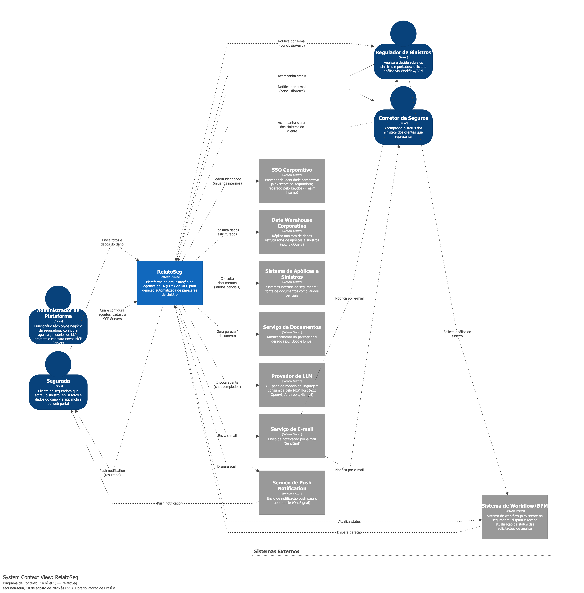

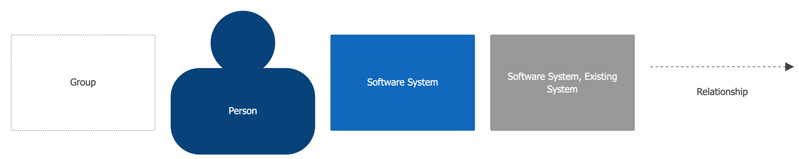

*Legenda de formas/cores da Figura 1.*

**Figura 1 – Diagrama de Contexto.** Fonte: elaborado pelo autor (gerado a partir do modelo C4 em Structurizr — [doc/c4/](https://github.com/bacelarnetto/tcc-puc-minas-arquitetura-software/tree/main/doc/c4), fonte editável, ver [view-contexto.dsl](https://github.com/bacelarnetto/tcc-puc-minas-arquitetura-software/blob/main/doc/c4/view-contexto.dsl)). Imagem em alta resolução: [3.1-contexto.png](https://github.com/bacelarnetto/tcc-puc-minas-arquitetura-software/blob/main/doc/relatorio/diagramas/3.1-contexto.png).

A Figura 1 mostra a especificação do diagrama geral (macroarquitetura) da solução proposta, com todos os atores e sistemas externos que interagem com a Plataforma RelatoSeg. A segurada pode enviar fotos e informações do dano diretamente pelo aplicativo mobile ou pelo web portal (aplicações separadas do Web Console interno — ver justificativa na seção 2.4), disparando a análise (entrada *self-service*). Alternativamente, o regulador de sinistros solicita a análise através do sistema de Workflow/BPM já existente na seguradora, que dispara a Plataforma RelatoSeg — comunicação bidirecional, já que a Plataforma também atualiza o Workflow/BPM com o status da análise. Regulador e corretor de seguros usam o Web Console para acompanhar o status das análises; o administrador de plataforma — funcionário técnico/de negócio da seguradora — usa uma aplicação separada, o **Agent Console** (ver justificativa na seção 2.4), para criar/configurar agentes, modelos de LLM e prompts, e cadastrar novos MCP Servers. Em todos os casos, a plataforma orquestra os agentes de IA — invocando o **provedor de LLM** contratado para cada chamada de chat completion —, consulta as fontes de dados da apólice e do sinistro (estruturadas no *data warehouse*, documentais como laudos periciais nos sistemas internos), gera o parecer final e notifica ativamente ao término do processo (sucesso ou erro): por e-mail para regulador e corretor, por push notification para a segurada — além de o resultado ficar sempre disponível sob consulta nos respectivos consoles.

### 3.2 Diagrama de Container

O Diagrama de Container descreve a arquitetura de alto nível do RelatoSeg, detalhando a distribuição das aplicações, bases de dados e filas de mensagens. Ele evidencia as fronteiras de execução do sistema e como o protocolo MCP orquestra o fluxo de dados entre os serviços.

> **Nota:** o Diagrama de Container é apresentado em três *views* complementares — prática aceita pelo C4 model quando um único diagrama fica denso demais para permanecer legível (aqui seriam ~23 containers e ~53 relações num só grafo). **3.2.1** cobre a entrada de negócio (autenticação, roteamento, gatilho da orquestração); **3.2.2** e **3.2.3** cobrem, juntas, os 5 *steps* que o Temporal orquestra — divididas só por legibilidade do diagrama, não por escopo de orquestração: **3.2.2** detalha os steps 1-4 (coleta e consolidação), **3.2.3** detalha o step 5 (notificação) e os dois consumidores independentes do resultado; o Temporal Server aciona os cinco da mesma forma (ver seção 2.4, "Orquestração da pipeline (steps 1-5)"). Containers como **API de Sinistros**, **MCP Host**, **Keycloak**, **Gateway** e **Temporal Server** reaparecem como nós de fronteira entre *views* quando participam de mais de um fluxo — prática normal no C4 model.

Antes de detalhar cada *view*, a Figura 2 mostra a **visão macro** — todos os 23 containers de uma vez, agrupados pelas mesmas 3 áreas (fronteiras tracejadas):

*Legenda de formas/cores da Figura 2.*

**Figura 2 – Diagrama de Container, visão macro.** Fonte: elaborado pelo autor (gerado a partir do modelo C4 em Structurizr — [doc/c4/](https://github.com/bacelarnetto/tcc-puc-minas-arquitetura-software/tree/main/doc/c4), fonte editável, ver [view-container-macro.dsl](https://github.com/bacelarnetto/tcc-puc-minas-arquitetura-software/blob/main/doc/c4/view-container-macro.dsl)). Imagem em alta resolução: [3.2-container-macro.png](https://github.com/bacelarnetto/tcc-puc-minas-arquitetura-software/blob/main/doc/relatorio/diagramas/3.2-container-macro.png).

#### 3.2.1 Entrada, Autenticação e Roteamento

Esta subseção detalha as portas de entrada de negócio da plataforma — o fluxo de autenticação compartilhado entre os canais de acesso (segurada, regulador, corretor e administrador) e o roteamento das solicitações até a API de Sinistros, ponto a partir do qual a orquestração durável do pipeline assume o processamento do sinistro.

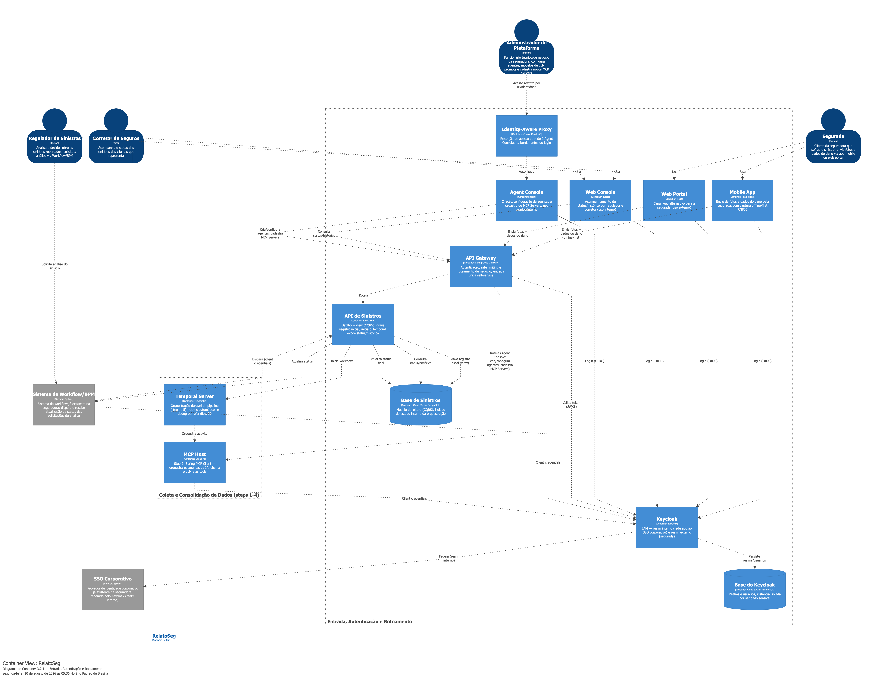

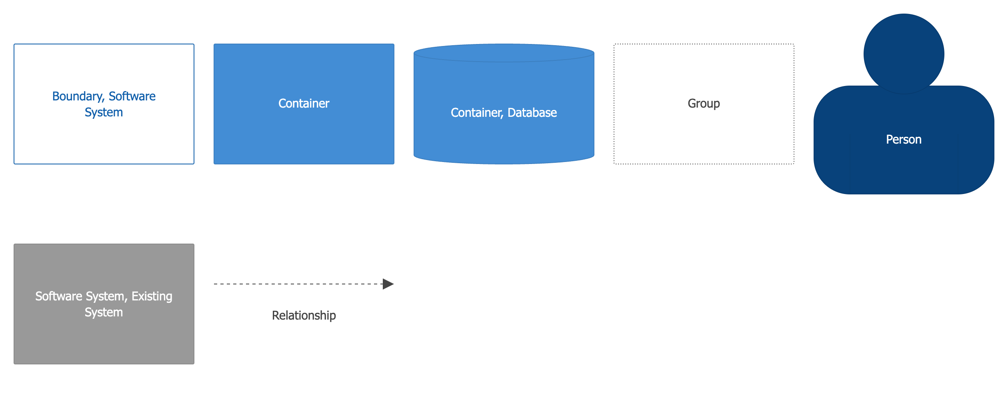

*Legenda de formas/cores da Figura 3.*

**Figura 3 – Diagrama de Container 3.2.1, Entrada, Autenticação e Roteamento.** Fonte: elaborado pelo autor (gerado a partir do modelo C4 em Structurizr — [doc/c4/](https://github.com/bacelarnetto/tcc-puc-minas-arquitetura-software/tree/main/doc/c4), fonte editável, ver [view-container-entrada.dsl](https://github.com/bacelarnetto/tcc-puc-minas-arquitetura-software/blob/main/doc/c4/view-container-entrada.dsl)). Imagem em alta resolução: [3.2.1-container-entrada.png](https://github.com/bacelarnetto/tcc-puc-minas-arquitetura-software/blob/main/doc/relatorio/diagramas/3.2.1-container-entrada.png).

A Figura 3 apresenta os containers responsáveis pela entrada de negócio. Antes de qualquer chamada de negócio, os clientes (Mobile App, Web Portal, Web Console, Agent Console) se autenticam no **Keycloak** via OAuth2/OIDC — um *realm* interno, federado ao SSO corporativo já existente na seguradora (regulador, corretor, administrador), e um *realm* externo com cadastro próprio (segurada). O token resultante carrega o papel do usuário como *claim*, usado pelo **API Gateway** para aplicar RBAC na borda, sem que cada serviço downstream precise reimplementar essa checagem. O fluxo tem três portas de entrada de negócio para o mesmo pipeline: as duas portas **self-service** passam pelo **API Gateway** único (autenticação, rate limiting e roteamento), já que carregam o token de usuário validado ali — a segurada envia fotos e dados do dano via **Mobile App** (React Native, com captura *offline-first*) ou **Web Portal** (React). Já a integração do regulador de sinistros, feita pelo sistema de Workflow/BPM já existente na seguradora, é uma chamada **service-to-service (M2M)** direta à **API de Sinistros**, autenticada via OAuth2 *client credentials* no Keycloak — sem passar pelo Gateway, pois não carrega token de usuário para RBAC por papel, e sim credencial do próprio sistema externo. Todo o tráfego de negócio (disparo e consulta de status) converge para a **API de Sinistros** — que segrega comando de leitura (padrão **CQRS** — *Command Query Responsibility Segregation*): ela grava um registro inicial na sua **própria base de leitura (Base de Sinistros)**, dispara a execução no **Temporal Server** e devolve o status atual sempre consultando essa mesma base, isolada do estado interno da orquestração. O **Web Console** (React) é de uso exclusivo de regulador e corretor, que o utilizam para acompanhar o status/histórico das solicitações. O **Agent Console** (React) é uma aplicação separada, de uso técnico/interno, restrita ao administrador de plataforma (funcionário técnico/de negócio da seguradora — ver justificativa na seção 2.4): antes mesmo do login, o acesso já é filtrado na borda pelo **Identity-Aware Proxy (IAP)**, que só deixa alcançar a aplicação usuários autorizados (ver justificativa na seção 2.4) — camada extra que os demais front ends não têm, dado o *blast radius* dessa superfície. Autenticado, o administrador cria e configura agentes (prompt, modelo de LLM) e cadastra novos MCP Servers, através do mesmo Gateway único, roteado ao **MCP Host** — persistência detalhada em 3.2.2. A partir da chamada `API de Sinistros → Temporal Server`, a orquestração durável do pipeline assume o fluxo, detalhada na próxima *view*.

#### 3.2.2 Coleta e Consolidação de Dados (steps 1-4)

Esta subseção detalha os steps 1 a 4 do pipeline, responsáveis por registrar a solicitação, orquestrar os agentes de IA e consolidar os dados coletados no metadado padronizado do parecer, até a geração do documento final.

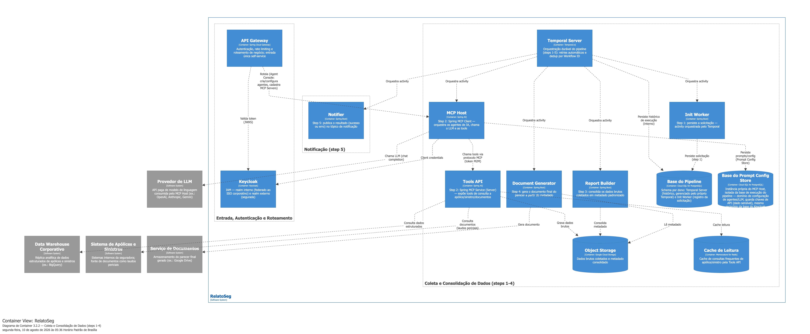

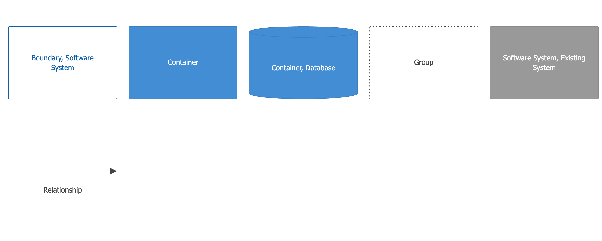

*Legenda de formas/cores da Figura 4.*

**Figura 4 – Diagrama de Container 3.2.2, Coleta e Consolidação de Dados (steps 1-4).** Fonte: elaborado pelo autor (gerado a partir do modelo C4 em Structurizr — [doc/c4/](https://github.com/bacelarnetto/tcc-puc-minas-arquitetura-software/tree/main/doc/c4), fonte editável, ver [view-container-pipeline.dsl](https://github.com/bacelarnetto/tcc-puc-minas-arquitetura-software/blob/main/doc/c4/view-container-pipeline.dsl)). Imagem em alta resolução: [3.2.2-container-pipeline.png](https://github.com/bacelarnetto/tcc-puc-minas-arquitetura-software/blob/main/doc/relatorio/diagramas/3.2.2-container-pipeline.png).

A Figura 4 detalha os steps 1 a 4 do pipeline. O Temporal orquestra de forma durável (com retries automáticos e deduplicação nativa por Workflow ID) uma sequência de 5 *activities*, mantendo a numeração original do pipeline: **step 1** (**Init Worker**) persiste a solicitação na **Base do Pipeline** (Cloud SQL for PostgreSQL), seguido por **step 2** (**MCP Host**), **step 3** (**Report Builder**) e **step 4** (**Document Generator**) — cada step com seu próprio container, dono exclusivo dos dados que grava. O MCP Host — implementado como **Spring MCP Client** — aciona os agentes de IA, chamando o **provedor de LLM** contratado (chat completion) e utilizando a **Tools API** — implementada como **Spring MCP Service (Server)** — para buscar as informações necessárias (dados do *data warehouse* e do sistema de apólices/sinistros, com cache de leitura no **Memorystore for Redis**), persistindo-as no storage intermediário; o MCP Host também persiste, numa instância própria de Cloud SQL isolada da base de execução do pipeline (Prompt Config Store — domínio de configuração de agentes/LLM, dado sensível como as chaves de API dos modelos, mesmo raciocínio já aplicado ao Keycloak), a configuração de agentes/modelos/prompts recebida do Agent Console (RF05). O **Report Builder** consolida esses dados brutos em um metadado padronizado, consumido pelo **Document Generator** para produzir o documento final. Concluído o step 4, o Temporal aciona o **step 5** (**Notifier**), detalhado na próxima *view*.

> **Nota sobre granularidade do status (RF14):** entre o disparo e a conclusão, nenhum dos steps 2-4 (MCP Host, Report Builder, Document Generator) atualiza a **Base de Sinistros** — só o registro inicial (gravado pela API de Sinistros no disparo) e o resultado final (via step 5, seção 3.2.3) chegam até ela. O progresso *step a step* já existe, mas só no histórico de execução interno do próprio Temporal Server, que a API de Sinistros deliberadamente não consulta (preserva *Database per Service* — ver seção 2.4). Trade-off aceito: o Web Console mostra status binário (recebido → concluído/erro) durante o processamento, sem granularidade por step, o que é razoável dado o tempo de resposta esperado (RNF04, até 10min p95). Se o produto exigir progresso intermediário no futuro, o mecanismo mais direto seria reaproveitar o padrão já existente (Pub/Sub → Notification Consumer, seção 3.2.3) para eventos de progresso, não só para o evento final — sem introduzir tecnologia nova.

#### 3.2.3 Notificação (step 5) e Consumo do Resultado

Esta subseção detalha o step 5 do pipeline, responsável por publicar o resultado do processamento e acioná-lo aos dois consumidores independentes: a atualização do status na Base de Sinistros e o envio da notificação ativa ao regulador, corretor e segurada.

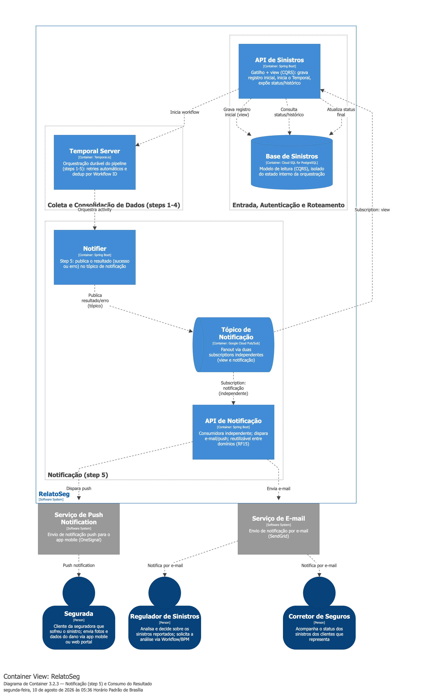

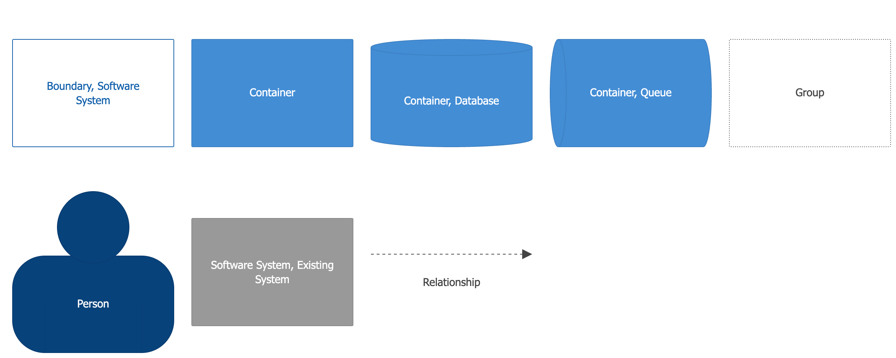

*Legenda de formas/cores da Figura 5.*

**Figura 5 – Diagrama de Container 3.2.3, Notificação (step 5) e Consumo do Resultado.** Fonte: elaborado pelo autor (gerado a partir do modelo C4 em Structurizr — [doc/c4/](https://github.com/bacelarnetto/tcc-puc-minas-arquitetura-software/tree/main/doc/c4), fonte editável, ver [view-container-notificacao.dsl](https://github.com/bacelarnetto/tcc-puc-minas-arquitetura-software/blob/main/doc/c4/view-container-notificacao.dsl)). Imagem em alta resolução: [3.2.3-container-notificacao.png](https://github.com/bacelarnetto/tcc-puc-minas-arquitetura-software/blob/main/doc/relatorio/diagramas/3.2.3-container-notificacao.png).

A Figura 5 detalha o step 5 e os dois consumidores independentes do resultado. O **Notifier** publica o resultado (ou erro) num tópico do **Google Cloud Pub/Sub**, consumido por duas *subscriptions* independentes entre si: a **API de Sinistros** atualiza a **Base de Sinistros** com o status final e o link do documento; em paralelo, a **API de Notificação** — desacoplada e reutilizável por outros domínios de negócio que venham a integrar a plataforma (RF15) — dispara o aviso ativo: e-mail via **SendGrid** para regulador/corretor, push via **OneSignal** para a segurada. Nenhum dos dois consumidores depende do outro: se a API de Notificação estiver indisponível, a atualização da Base de Sinistros não é afetada, e vice-versa. Os clientes (Mobile App, Web Portal, Web Console) sempre podem consultar a Base de Sinistros sob demanda, nunca o estado interno da orquestração, mas não dependem só da consulta: a notificação ativa avisa proativamente quando o resultado sai.

> **Nota sobre tratamento de erro em qualquer step (RF12):** por padrão, se uma *activity* (MCP Host, Report Builder ou Document Generator) esgota sua política de retry e falha definitivamente, o Temporal apenas marca a execução do workflow como "Failed" e para — o **step 5 (Notifier) nunca seria acionado**, e o erro nunca chegaria ao Pub/Sub, à Base de Sinistros ou ao e-mail do regulador, quebrando o RF12. Por isso o **workflow captura a falha de qualquer step e aciona o Notifier mesmo assim** (padrão try/catch dentro da lógica do workflow, funcionando como um "finally" que sempre notifica, com sucesso ou erro) — o Notifier passa a rodar tanto no caminho feliz quanto no caminho de erro, só variando o status publicado. Essa orquestração é código próprio do autor (a definição do workflow do Temporal, executada por um worker), mas não aparece como componente isolado no Diagrama de Componentes (seção 3.3) — por legibilidade, foi tratada como parte do container **Temporal Server**, apesar de este estar classificado ali como adquirido/gerido, sem lógica de negócio própria. O histórico técnico da falha (qual step, quantas tentativas, motivo) fica automaticamente no histórico de execução do Temporal Server (Base do Pipeline, seção 2.4) — auditável via Temporal Web UI/SDK para fins operacionais, mas não exposto ao regulador via Web Console (RNF05 é atendido no nível técnico/interno; o nível de negócio permanece o status binário descrito na nota da seção 3.2.2). Dados brutos já coletados antes da falha (fotos, documentos) permanecem no Object Storage — chave determinística (seção 2.4) —, preservando evidência parcial mesmo em pareceres que não concluíram.

### 3.3 Diagrama de Componentes

O Diagrama de Componentes decompõe os containers do sistema em suas unidades funcionais e módulos de código. A estrutura a seguir detalha as responsabilidades internas da API de Sinistros, do MCP Host e das ferramentas de suporte, destacando a aplicação de padrões de projeto e arquitetura hexagonal.

O diagrama cobre os **8 containers de aplicação com lógica própria desenvolvida** (API de Sinistros, MCP Host, Tools API, Init Worker, Report Builder, Document Generator, Notifier, API de Notificação) — dos 23 containers do Diagrama de Container (seção 3.2), os 15 restantes ficam de fora por não terem estrutura de componentes própria a detalhar: os 4 front-ends React/React Native (Mobile App, Web Portal, Web Console, Agent Console — SPAs) e os 11 containers adquiridos/geridos como serviço ou configurados sobre framework pronto, sem lógica de negócio própria (API Gateway, Identity-Aware Proxy, Keycloak, Temporal Server, e as 7 bases de dados/mensageria: Base do Keycloak, Base de Sinistros, Base do Pipeline, Base do Prompt Config Store, Object Storage, Cache de Leitura, Tópico de Notificação). Igual ao Diagrama de Container, dividido em múltiplas *views* por legibilidade — um grafo único teria ~38 componentes/interfaces e ~33 relações: **3.3.1** cobre a API de Sinistros (CQRS, entrada); **3.3.2** cobre MCP Host e Tools API (agentes e tools, step 2); **3.3.3** cobre Init Worker, Report Builder e Document Generator (steps 1, 3 e 4); **3.3.4** cobre Notifier e API de Notificação (step 5). Toda vez que um componente cruza uma fronteira externa (banco de dados, SDK de terceiro, API de terceiro), ele o faz através de uma interface própria — nenhum componente depende diretamente de uma classe concreta externa.

#### 3.3.1 API de Sinistros (Entrada)

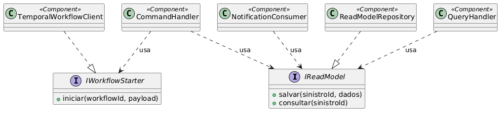

**Figura 6 – Diagrama de Componentes 3.3.1, API de Sinistros.** Fonte: elaborado pelo autor (gerado a partir da fonte PlantUML — [doc/uml/](https://github.com/bacelarnetto/tcc-puc-minas-arquitetura-software/tree/main/doc/uml), fonte editável, ver [3.3.1-api-sinistros.puml](https://github.com/bacelarnetto/tcc-puc-minas-arquitetura-software/blob/main/doc/uml/3.3.1-api-sinistros.puml), renderizar com [render.sh](https://github.com/bacelarnetto/tcc-puc-minas-arquitetura-software/blob/main/doc/uml/render.sh)). Imagem em alta resolução: [3.3.1-api-sinistros.png](https://github.com/bacelarnetto/tcc-puc-minas-arquitetura-software/blob/main/doc/relatorio/diagramas/3.3.1-api-sinistros.png).

A Figura 6 apresenta os componentes da API de Sinistros.

#### 3.3.2 MCP Host e Tools API (Agentes e Tools)

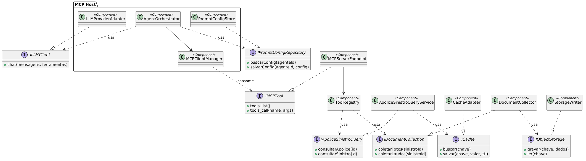

**Figura 7 – Diagrama de Componentes 3.3.2, MCP Host e Tools API.** Fonte: elaborado pelo autor (gerado a partir da fonte PlantUML — [doc/uml/](https://github.com/bacelarnetto/tcc-puc-minas-arquitetura-software/tree/main/doc/uml), fonte editável, ver [3.3.2-mcp-host-tools-api.puml](https://github.com/bacelarnetto/tcc-puc-minas-arquitetura-software/blob/main/doc/uml/3.3.2-mcp-host-tools-api.puml), renderizar com [render.sh](https://github.com/bacelarnetto/tcc-puc-minas-arquitetura-software/blob/main/doc/uml/render.sh)). Imagem em alta resolução: [3.3.2-mcp-host-tools-api.png](https://github.com/bacelarnetto/tcc-puc-minas-arquitetura-software/blob/main/doc/relatorio/diagramas/3.3.2-mcp-host-tools-api.png).

A Figura 7 apresenta os componentes do MCP Host e da Tools API.

#### 3.3.3 Init Worker, Report Builder e Document Generator (Coleta e Consolidação — steps 1, 3, 4)

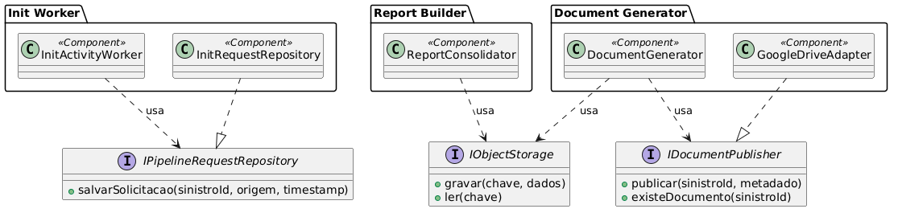

**Figura 8 – Diagrama de Componentes 3.3.3, Init Worker, Report Builder e Document Generator.** Fonte: elaborado pelo autor (gerado a partir da fonte PlantUML — [doc/uml/](https://github.com/bacelarnetto/tcc-puc-minas-arquitetura-software/tree/main/doc/uml), fonte editável, ver [3.3.3-init-report-document.puml](https://github.com/bacelarnetto/tcc-puc-minas-arquitetura-software/blob/main/doc/uml/3.3.3-init-report-document.puml), renderizar com [render.sh](https://github.com/bacelarnetto/tcc-puc-minas-arquitetura-software/blob/main/doc/uml/render.sh)). Imagem em alta resolução: [3.3.3-init-report-document.png](https://github.com/bacelarnetto/tcc-puc-minas-arquitetura-software/blob/main/doc/relatorio/diagramas/3.3.3-init-report-document.png).

A Figura 8 apresenta os componentes dos steps 1, 3 e 4. `IObjectStorage` é a mesma porta realizada pelo **Storage Writer** na Figura 7 (Object Storage é um container só, compartilhado entre Tools API, Report Builder e Document Generator) — não repetida aqui por já pertencer ao grupo de componentes da Tools API.

#### 3.3.4 Notifier e API de Notificação (Notificação — step 5)

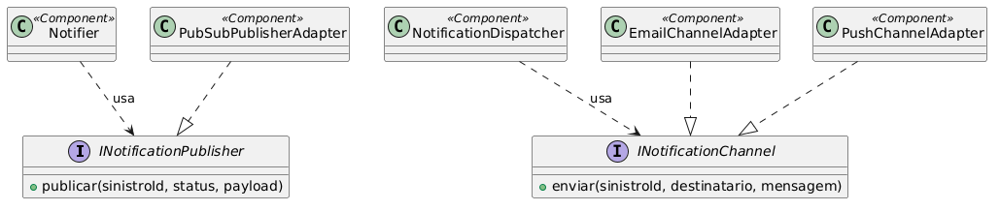

**Figura 9 – Diagrama de Componentes 3.3.4, Notifier e API de Notificação.** Fonte: elaborado pelo autor (gerado a partir da fonte PlantUML — [doc/uml/](https://github.com/bacelarnetto/tcc-puc-minas-arquitetura-software/tree/main/doc/uml), fonte editável, ver [3.3.4-notifier-notificacao.puml](https://github.com/bacelarnetto/tcc-puc-minas-arquitetura-software/blob/main/doc/uml/3.3.4-notifier-notificacao.puml), renderizar com [render.sh](https://github.com/bacelarnetto/tcc-puc-minas-arquitetura-software/blob/main/doc/uml/render.sh)). Imagem em alta resolução: [3.3.4-notifier-notificacao.png](https://github.com/bacelarnetto/tcc-puc-minas-arquitetura-software/blob/main/doc/relatorio/diagramas/3.3.4-notifier-notificacao.png).

A Figura 9 apresenta os componentes do step 5.

**Estilos/padrões arquiteturais utilizados:** *Arquitetura Hexagonal* (**Ports & Adapters**, COCKBURN, 2005) — princípio guarda-chuva aplicado de forma consistente nos 8 containers: nenhum componente de negócio depende diretamente de uma classe concreta externa (banco, SDK de terceiro, API de terceiro); toda travessia de fronteira externa passa por uma interface (*porta*) realizada por um componente dedicado (*adapter*), isolando o núcleo de decisão (Agent Orchestrator, Command/Query Handler, Document Generator, Notification Dispatcher) da tecnologia concreta por trás — os padrões a seguir são instâncias concretas desse princípio. *CQRS* (API de Sinistros: Command Handler separado do Query Handler, cada um com seu próprio caminho de dados); *Publish-Subscribe* (Pub/Sub com duas *subscriptions* independentes: API de Sinistros e API de Notificação consomem o mesmo evento do Notifier de forma independente, sem se conhecerem); *Adapter* (Temporal Workflow Client, LLM Provider Adapter, Cache Adapter, Google Drive Adapter e Pub/Sub Publisher Adapter — cada um isolando um componente interno de um SDK/API de terceiro específico, atrás de uma interface própria); *Strategy* (Email Channel Adapter e Push Channel Adapter realizam a mesma `INotificationChannel`; o Notification Dispatcher escolhe o canal em tempo de execução sem conhecer a implementação concreta — a mesma porta com dois adapters é também o exemplo mais didático da Arquitetura Hexagonal neste diagrama); *Registry* (Tool Registry, permitindo cadastrar novas tools sem alterar o MCP Server Endpoint); *Facade* (MCP Server Endpoint, expondo um ponto único de entrada MCP sobre múltiplas tools internas); *Gateway/Repository* (Apólice/Sinistro Query Service, Storage Writer, Read Model Repository, Init Request Repository e Prompt Config Store, isolando o acesso a sistemas externos e a bases de leitura/escrita).

**Descrição dos componentes:**

| Componente | Papel | Classificação |
| --- | --- | --- |
| Command Handler | Recebe a solicitação de disparo (do API Gateway ou do Workflow/BPM), valida uma chave de idempotência (gerada pelo cliente — essencial no canal self-service, onde o `sinistro_id` ainda não existe no momento do envio) e inicia a execução no Temporal Server via `IWorkflowStarter`, usando um Workflow ID determinístico (dedup); a gravação inicial na Base de Sinistros (view) também é um UPSERT idempotente | A desenvolver |
| Query Handler | Recebe a solicitação de consulta de status/histórico (RF14) e lê da Base de Sinistros, isolada do estado interno da orquestração | A desenvolver |
| Notification Consumer | Consome o evento final (sucesso/erro) publicado pelo Notifier via *subscription* própria no tópico do Pub/Sub (entrega *at-least-once*) e aplica UPSERT idempotente na Base de Sinistros por `sinistro_id` (seguro contra reentrega). Consumidor independente da API de Notificação — as duas reagem ao mesmo evento sem se conhecerem | A desenvolver |
| Read Model Repository | Persiste e consulta a Base de Sinistros (modelo de leitura), usada pelo Query Handler e pelo Notification Consumer | A desenvolver |
| Temporal Workflow Client | Adapta o Command Handler ao Temporal Java SDK — inicia a execução do workflow com o Workflow ID determinístico recebido | A desenvolver (usa biblioteca reutilizada — Temporal Java SDK) |
| Agent Orchestrator | Coordena o ciclo do agente: decide quando chamar o LLM, quando invocar uma tool e quando encerrar, retornando o resultado consolidado | A desenvolver |
| LLM Provider Adapter | Abstrai o provedor de LLM (OpenAI, Anthropic, Gemini) via Spring AI `ChatClient`, permitindo trocar o modelo sem alterar o Agent Orchestrator | A desenvolver (usa biblioteca reutilizada — Spring AI) |
| Prompt Config Store | Armazena e disponibiliza os prompts, variáveis de ambiente, chaves de API dos modelos e o mapeamento de URLs/portas dos MCP Servers, configurados via Agent Console (RF05) e persistidos em instância própria de Cloud SQL for PostgreSQL, isolada da base de execução do pipeline (dado sensível) | A desenvolver |
| MCP Client Manager | Conecta-se aos MCP Services via transporte (Streamable HTTP, SSE ou Stdio), descobre dinamicamente as tools disponíveis (`tools/list`) e injeta as referências no LLM antes de invocá-las (`tools/call`) | A desenvolver (usa biblioteca reutilizada — Spring AI MCP Client) |
| MCP Server Endpoint | Expõe as tools da Tools API via protocolo MCP (funções anotadas com `@McpTool` e *resources*), aplicando validação de entrada, permissões de acesso e rate limiting | A desenvolver (usa biblioteca reutilizada — Spring AI MCP Server) |
| Tool Registry | Registra e descreve as tools disponíveis (ex.: consultar apólice, consultar sinistro, coletar documentos) | A desenvolver |
| Apólice/Sinistro Query Service | Implementa a consulta a dados estruturados de apólice e sinistro no *data warehouse* | A desenvolver |
| Document Collector | Coleta fotos do dano e laudos periciais dos sistemas internos e do envio via app mobile | A desenvolver |
| Cache Adapter | Cacheia consultas frequentes de apólice/sinistro | A desenvolver (usa biblioteca reutilizada — cliente Redis) |
| Storage Writer | Grava os dados brutos coletados no *object storage* intermediário, usando chave de objeto determinística (`sinistroId/documentoId`) para que retries de chamada de tool sobrescrevam em vez de duplicar | A desenvolver (usa biblioteca reutilizada — cliente Cloud Storage) |
| Init Activity Worker | Recebe a *activity* "init" (step 1) orquestrada pelo Temporal e monta o registro da solicitação (`sinistro_id`, origem, timestamp) | A desenvolver |
| Init Request Repository | Persiste o registro da solicitação na Base do Pipeline, em UPSERT idempotente por `sinistro_id` | A desenvolver |
| Report Consolidator | Lê os dados brutos já coletados (Object Storage) e grava o metadado padronizado consolidado (step 3) | A desenvolver |
| Document Generator | Lê o metadado consolidado, checa se já existe documento gerado para o `sinistro_id` (idempotência — criação no Drive não é idempotente por natureza) e publica o parecer final (step 4) | A desenvolver |
| Google Drive Adapter | Adapta o Document Generator à Google Drive API — cria o documento e permite checar existência prévia | A desenvolver (usa biblioteca reutilizada — Google Drive API client) |
| Notifier | Publica o resultado (sucesso ou erro) do processamento no tópico de notificação (step 5) | A desenvolver |
| Pub/Sub Publisher Adapter | Adapta o Notifier ao cliente do Google Cloud Pub/Sub | A desenvolver (usa biblioteca reutilizada — cliente Google Cloud Pub/Sub) |
| Notification Dispatcher | Consome o evento final via *subscription* própria (independente da API de Sinistros) e decide o(s) canal(is) de notificação, aplicando *dedup* por `sinistro_id` | A desenvolver |
| Email Channel Adapter | Adapta o Notification Dispatcher ao SendGrid | A desenvolver (usa biblioteca reutilizada — cliente SendGrid) |
| Push Channel Adapter | Adapta o Notification Dispatcher ao OneSignal | A desenvolver (usa biblioteca reutilizada — cliente OneSignal) |

**Componentes adquiridos/reutilizados (não desenvolvidos):** provedor de LLM (API paga do provedor escolhido), BigQuery, Cloud Storage, Google Drive API, SendGrid (e-mail), OneSignal (push notification), Keycloak (IAM, self-hosted, sem código próprio de autenticação) — todos consumidos/configurados como serviços prontos, sem código próprio de infraestrutura; os *Adapters* (Temporal Workflow Client, LLM Provider Adapter, Cache Adapter, Google Drive Adapter, Pub/Sub Publisher Adapter, Email/Push Channel Adapter) são código próprio fino sobre bibliotecas cliente reutilizadas, não sobre infraestrutura própria.

> **Pontos de idempotência e deduplicação:** todo ponto de reentrega/retry da arquitetura tem um mecanismo de idempotência correspondente, evitando duplicidade de efeito colateral. O Temporal garante execução *exactly-once* da lógica do workflow em si, mas cada *activity* pode ser reexecutada em caso de falha/timeout — por isso cada uma precisa ser idempotente individualmente; leituras (Query Handler, Apólice/Sinistro Query Service) não precisam de tratamento, por não terem efeito colateral.
>
> 1. **Início do workflow** (Command Handler → Temporal): Workflow ID determinístico por `sinistro_id`, dedup nativa do Temporal — não precisa de lock adicional (por isso não usamos Redis para esse fim, como discutido na seção 2.4). Suficiente sozinho no canal do regulador, onde o sinistro já existe antes da chamada.
> 2. **Envio/reenvio self-service** (segurada, via mobile offline-first ou web portal): como o `sinistro_id` ainda não existe nesse momento, o Workflow ID sozinho não basta — o Command Handler exige uma chave de idempotência gerada no cliente, tanto para decidir se inicia um novo workflow quanto para o UPSERT do registro inicial na Base de Sinistros.
> 3. **Retry da *activity* "init"** (**Init Worker**, step 1, container próprio): UPSERT idempotente por `sinistro_id` na base de estado do pipeline (Cloud SQL, compartilhada em schema separado com o Temporal Server).
> 4. **Retry das *activities* "Report Builder" e "Document Generator"** (steps 3 e 4): o Report Builder grava o metadado consolidado com chave determinística no storage (mesmo padrão do Storage Writer). O Document Generator é o ponto mais delicado — a criação de arquivo no Google Drive **não é idempotente por natureza** (duas chamadas criam dois arquivos); a *activity* precisa checar, antes de gerar, se já existe um documento para aquele `sinistro_id` (guardando o ID do arquivo no estado do workflow ou buscando por nome determinístico), evitando parecer duplicado.
> 5. **Reentrega do Pub/Sub** (*at-least-once*, duas *subscriptions* independentes): o Notification Consumer (API de Sinistros) aplica UPSERT idempotente por `sinistro_id` na Base de Sinistros; a **API de Notificação** também precisa ser idempotente do seu lado (ex.: chave de deduplicação por `sinistro_id` antes de reenviar e-mail/push), já que ambos os consumidores podem receber a mesma mensagem mais de uma vez, independentemente um do outro. Cobre também um eventual reenvio duplicado do lado do Notifier (publish retry).
> 6. **Retry de chamada de tool** (Storage Writer, coleta de documentos): chave de objeto determinística no *object storage*, tornando a gravação idempotente por natureza (sobrescreve em vez de duplicar).

---

## 4. Avaliação da Arquitetura (ATAM)

A avaliação segue o método **ATAM** (*Architecture Tradeoff Analysis Method*), conforme descrito por Bass, Clements e Kazman (2021).

### 4.1 Análise das Abordagens Arquiteturais

| Atributo de Qualidade | Cenário | Importância | Complexidade |
| --- | --- | --- | --- |
| Segurança/Privacidade | RNF01 — autenticação/autorização na borda (OIDC + RBAC) e autenticação service-to-service | Alta | Média |
| Extensibilidade | RNF02 — extensão de domínio via novo MCP Server, sem alterar o MCP Host | Alta | Baixa |
| Disponibilidade | RNF03 — disponibilidade da infraestrutura própria vs. dependência de terceiros | Média | Média |
| Desempenho / Eficiência de custo | RNF04 — trade-off entre custo de token de LLM, latência e qualidade do raciocínio | Alta | Média |
| Rastreabilidade | RNF05 — auditabilidade ponta a ponta via histórico durável do Temporal e logging centralizado | Média | Baixa |
| Usabilidade/Offline | RNF06 — captura offline e sincronização automática de evidências no app mobile | Média | Alta |

Cada atributo de qualidade acima é endereçado por uma abordagem arquitetural específica, detalhada nos mecanismos (seção 2.4) e avaliada em profundidade nos cenários a seguir (4.2/4.3). **Segurança/Privacidade (RNF01)** é resolvida na borda: OAuth2/OIDC via Keycloak com dois *realms*, RBAC aplicado uma única vez no API Gateway, e autenticação de serviço própria na Tools API para o caminho M2M que não passa pelo Gateway. **Extensibilidade (RNF02)** decorre da genericidade do protocolo MCP: o MCP Host não conhece o domínio de negócio, então um novo MCP Server se conecta via `tools/list`/`tools/call` sem alteração de código, com a configuração de agente feita em runtime pelo Agent Console. **Disponibilidade (RNF03)** é sustentada pela topologia GKE multi-zona combinada a serviços gerenciados do GCP (Cloud SQL, Memorystore, Pub/Sub), cada um com SLA próprio, tirando da plataforma a responsabilidade de operar alta disponibilidade para componentes com estado. **Desempenho/Eficiência de custo (RNF04)** é abordado pelo `LLM Provider Adapter` (*model tiering* por *step* do pipeline, reduzindo tokens reenviados ao provedor de LLM) combinado a cache de leitura no Memorystore na Tools API, que reduz latência/carga de acesso à fonte (BigQuery), não os tokens enviados ao LLM. **Rastreabilidade (RNF05)** apoia-se no histórico de execução imutável do Temporal (por *activity*) somado a *logging* estruturado correlacionado por `sinistro_id` (SLF4J/Logback → Promtail → Loki → Grafana). **Usabilidade/Offline (RNF06)** é resolvida no Mobile App via fila local persistente, *upload* retomável com URL pré-assinada e chave de idempotência gerada no cliente, evitando tanto perda de dados quanto duplicidade ao reconectar.

### 4.2 Cenários

- **Cenário RNF01 (Segurança/Privacidade)** — autenticação/autorização na borda (Keycloak + RBAC no API Gateway) e autenticação service-to-service para as integrações M2M, ver Tabela abaixo e evidências na seção 4.3
- **Cenário RNF02 (Extensibilidade)** — extensão para um novo domínio de negócio via novo MCP Server, sem alterar o MCP Host, dentro do prazo de 10 dias-homem, ver Tabela abaixo e evidências na seção 4.3
- **Cenário RNF03 (Disponibilidade)** — disponibilidade de 99,9% sustentada pela infraestrutura própria da plataforma, com a fronteira explícita frente a dependências de terceiros, ver Tabela abaixo e evidências na seção 4.3
- **Cenário RNF04 (Desempenho e Escalabilidade)** — trade-off entre custo de token de LLM, latência e qualidade do raciocínio, ver Tabela abaixo e evidências na seção 4.3
- **Cenário RNF05 (Rastreabilidade)** — auditabilidade ponta a ponta de um parecer via histórico durável do Temporal e logging centralizado, ver Tabela abaixo e evidências na seção 4.3
- **Cenário RNF06 (Usabilidade e Disponibilidade Offline)** — captura de fotos sem conectividade no app mobile, com sincronização automática e sem duplicidade ao reconectar, ver Tabela abaixo e evidências na seção 4.3

O critério CA-2.2 exige um cenário para cada RNF da seção 2.3 — os 6 RNF estão cobertos 1:1 pelos 6 cenários acima. Os riscos que **excedem o escopo de cada RNF individual** (não são o cenário principal do atributo, mas surgem da análise dele) não geram cenário ATAM próprio; são tratados na tabela "Riscos declarados e tratamento" ao final da seção 4.3.

### 4.3 Evidências da Avaliação

Cada cenário segue a estrutura clássica do ATAM (BASS; CLEMENTS; KAZMAN, 2021): Atributo de Qualidade/Requisito, o cenário propriamente dito (síntese estímulo → ambiente → resposta), a decomposição do cenário (Preocupação/Ambiente/Estímulo/Mecanismo/Medida de resposta) e, por fim, as considerações sobre a arquitetura — **Pontos de Sensibilidade** (o que a resposta depende criticamente), **Tradeoff** (quando a mesma decisão favorece um atributo de qualidade às custas de outro) e **Riscos** (decisões ainda em aberto ou não cobertas).

#### Cenário RNF01 — Segurança e Privacidade (RBAC na borda e autenticação service-to-service)

- **Atributo de Qualidade:** Segurança (autenticação, autorização, confidencialidade de dados sensíveis)
- **Requisito:** RNF01 — autenticação via OAuth2/OIDC (Keycloak), RBAC por papel aplicado na borda, autenticação por serviço e rate limiting na Tools API, criptografia em trânsito e em repouso

##### Cenário
Se uma requisição chegar sem token válido, fora do RBAC do papel do usuário, ou tentar contornar o API Gateway para acessar a Tools API diretamente, a plataforma deve rejeitá-la na borda, antes de alcançar a lógica de negócio.

##### Preocupação
Um usuário autenticado tenta acessar um recurso fora do seu papel (ex.: corretor consultando sinistro de outro corretor), ou uma chamada tenta contornar o API Gateway e acessar a Tools API diretamente

##### Ambiente
Produção, tráfego dos 4 canais de cliente (Mobile App, Web Portal, Web Console, Agent Console) somado à integração service-to-service do Workflow/BPM e do MCP Host

##### Estímulo
Uma requisição chega ao API Gateway com token JWT expirado ou sem o papel (*claim*) necessário para o recurso solicitado; ou uma tentativa de chamar a Tools API diretamente, sem passar pelo Gateway

##### Mecanismo
(1) Keycloak emite o JWT com o papel do usuário como *claim*, após OIDC, em dois *realms* (interno federado ao SSO corporativo, externo para a segurada); (2) o API Gateway valida a assinatura via JWKS e aplica RBAC na borda antes de rotear, dispensando cada serviço downstream de reimplementar a checagem (seção 3.2.1); (3) a Tools API expõe autenticação por serviço própria (*client credentials*) e rate limiting como segunda camada, cobrindo o caminho M2M que não passa pelo Gateway (Workflow/BPM, MCP Host); (4) dados sensíveis (credenciais, chaves de API de LLM) ficam em bases isoladas por domínio (Base do Keycloak, Base do Prompt Config Store), com criptografia em repouso do Cloud SQL

##### Medida de resposta
Requisição sem token válido ou fora do RBAC é rejeitada (401/403) no API Gateway, antes de alcançar a lógica de negócio; tentativa de bypass da Tools API é barrada pela autenticação de serviço própria; nenhuma credencial sensível trafega ou é persistida em texto claro

##### Considerações sobre a arquitetura

- **Pontos de Sensibilidade:** A resposta de segurança depende inteiramente da correção da configuração de RBAC no API Gateway — é o único ponto de decisão para os 4 canais *self-service*; qualquer alteração nessa configuração afeta os quatro simultaneamente
- **Tradeoff:** Centralizar o RBAC no Gateway evita reimplementar a checagem em cada serviço downstream (ganho de modificabilidade/simplicidade), mas concentra o *blast radius* de uma eventual falha de configuração — modificabilidade × segurança
- **Riscos:** Uma credencial M2M comprometida (ex.: do Workflow/BPM ou do MCP Host) contorna o RBAC do Gateway por desenho, já que não passa por ele; a estratégia de rotação/revogação dessas credenciais de serviço não foi aprofundada neste trabalho (fora do escopo de modelagem arquitetural). Já a validação de assinatura via JWKS em si é um mecanismo padrão e amplamente adotado (OAuth2/OIDC) — não é um ponto de incerteza arquitetural

**Evidência textual:** seção 2.4 (Mecanismos Arquiteturais), linhas "Autenticação/Autorização (IAM)" e "Persistência (IAM)", combinadas com o texto da seção 3.2.1 que descreve a validação de token via JWKS no API Gateway e a autenticação M2M via *client credentials* para as integrações service-to-service (Workflow/BPM → API de Sinistros, MCP Host → Tools API).

**Evidência em figura:** Figura 10, sequência dedicada mostrando os dois caminhos do Estímulo em ação — token inválido/fora do RBAC rejeitado (401/403) no API Gateway, e tentativa de bypass direto à Tools API barrada pela autenticação de serviço própria.

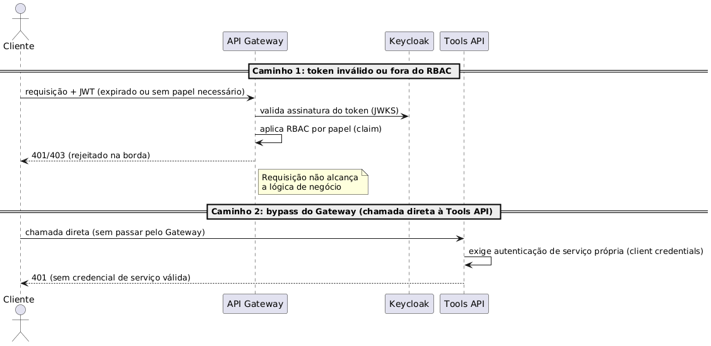

**Figura 10 – Sequência de rejeição de acesso não autorizado (RNF01).** Fonte: elaborado pelo autor (gerado a partir da fonte PlantUML — [doc/uml/](https://github.com/bacelarnetto/tcc-puc-minas-arquitetura-software/tree/main/doc/uml), fonte editável, ver [4.3-rnf01-rejeicao-acesso.puml](https://github.com/bacelarnetto/tcc-puc-minas-arquitetura-software/blob/main/doc/uml/4.3-rnf01-rejeicao-acesso.puml), renderizar com [render.sh](https://github.com/bacelarnetto/tcc-puc-minas-arquitetura-software/blob/main/doc/uml/render.sh)). Imagem em alta resolução: [4.3-rnf01-rejeicao-acesso.png](https://github.com/bacelarnetto/tcc-puc-minas-arquitetura-software/blob/main/doc/relatorio/diagramas/4.3-rnf01-rejeicao-acesso.png).

---

#### Cenário RNF02 — Extensibilidade (novo domínio via MCP Server)

- **Atributo de Qualidade:** Modificabilidade/Extensibilidade
- **Requisito:** RNF02 — integrar um novo MCP Server (novo domínio de negócio) em até 10 dias-homem, sem alteração no MCP Host

##### Cenário
Se uma nova área de negócio precisar de um relatório automatizado, um novo MCP Server deve viabilizar essa extensão em até 10 dias-homem, sem alterar o MCP Host.

##### Preocupação
Adicionar um novo domínio de negócio (ex.: subscrição de risco, sinistros de automóvel) exigir, na prática, alterar o núcleo de orquestração de agentes — o que romperia a tese central da arquitetura de referência (reuso multi-domínio, RF15)

##### Ambiente
Desenvolvimento, uma equipe (não necessariamente a mesma que implementou o domínio de Sinistros) construindo um novo domínio sobre a mesma plataforma

##### Estímulo
Uma área de negócio diferente solicita um novo tipo de relatório automatizado, reaproveitando a orquestração de agentes já existente

##### Mecanismo
(1) o protocolo MCP padroniza a descoberta e a chamada de *tools* (`tools/list`/`tools/call`) — o MCP Host (Agent Orchestrator) é genérico por construção, sem conhecimento do domínio de negócio; (2) um novo domínio implementa apenas o seu próprio MCP Server (Tools API), seguindo o mesmo padrão Facade/Registry já usado pelo domínio de Sinistros (seção 3.3); (3) a configuração de agente/prompt/modelo para o novo domínio é feita em runtime via Agent Console (RF05, Prompt Config Store), sem deploy de código no MCP Host

##### Medida de resposta
Esforço de implementação do novo MCP Server (*tools* + testes) dentro de 10 dias-homem; zero linhas alteradas no código do MCP Host

##### Considerações sobre a arquitetura

- **Pontos de Sensibilidade:** O prazo de 10 dias-homem e o "zero alteração no MCP Host" são sensíveis à suposição de que o novo domínio se encaixa no padrão genérico de interação (disparo → chamada de *tools* → consolidação da resposta)
- **Tradeoff:** Manter o MCP Host 100% genérico (ganho de extensibilidade/reuso entre domínios) tem como contrapartida não suportar, sem alteração, domínios com um padrão de interação muito diferente (ex.: conversação multi-turno) — extensibilidade para domínios similares × flexibilidade para domínios heterogêneos
- **Riscos:** Não foi validado empiricamente neste trabalho — apenas o domínio de Sinistros foi modelado; RF15/RNF02 são validados só ao nível de modelagem, sem um segundo domínio real implementado, então o prazo de 10 dias-homem é uma estimativa de design, não uma medida. Ponto que reduz esse risco: a configuração de agente/prompt/modelo via Agent Console (RF05) não exige *deploy*, então a parametrização em si não deve estourar o prazo — a incerteza está concentrada na implementação das *tools*, que varia por domínio

**Evidência textual:** Objetivos (seção 1, arquitetura de referência multi-domínio) e RF15, combinados com a linha "Orquestração de agentes" da seção 2.4 (Mecanismos Arquiteturais), que descreve o MCP Host como consumidor de *tools* via protocolo MCP, sem acoplamento a um domínio específico.

**Evidência em figura:** Figura 11, recorte dedicado do MCP Host/Tools API mostrando o `Tool Registry` e o `MCP Server Endpoint` (padrões Registry/Facade) replicados por um novo domínio hipotético, sem tocar no `Agent Orchestrator` do MCP Host.

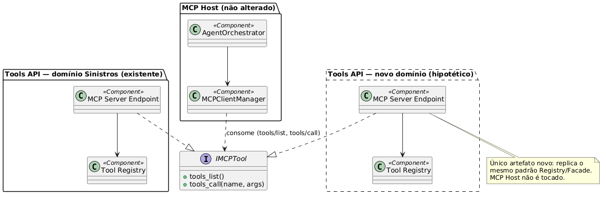

**Figura 11 – Recorte de extensão via novo domínio MCP (RNF02).** Fonte: elaborado pelo autor (gerado a partir da fonte PlantUML — [doc/uml/](https://github.com/bacelarnetto/tcc-puc-minas-arquitetura-software/tree/main/doc/uml), fonte editável, ver [4.3-rnf02-extensao-dominio.puml](https://github.com/bacelarnetto/tcc-puc-minas-arquitetura-software/blob/main/doc/uml/4.3-rnf02-extensao-dominio.puml), renderizar com [render.sh](https://github.com/bacelarnetto/tcc-puc-minas-arquitetura-software/blob/main/doc/uml/render.sh)). Imagem em alta resolução: [4.3-rnf02-extensao-dominio.png](https://github.com/bacelarnetto/tcc-puc-minas-arquitetura-software/blob/main/doc/relatorio/diagramas/4.3-rnf02-extensao-dominio.png).

---

#### Cenário RNF03 — Disponibilidade (infraestrutura própria vs. dependência de terceiros)

- **Atributo de Qualidade:** Disponibilidade
- **Requisito:** RNF03 — disponibilidade de 99,9%/mês em horário comercial

##### Cenário
Se um nó, uma zona do cluster ou um componente de infraestrutura própria falhar, a plataforma deve manter 99,9%/mês de disponibilidade em horário comercial, sem interromper solicitações em andamento.

##### Preocupação
Falha de infraestrutura (pod, nó, zona) ou indisponibilidade de uma dependência de terceiro (provedor de LLM, Google Drive API, SendGrid, OneSignal) interrompe o fluxo fim a fim de uma solicitação

##### Ambiente
Produção, cluster **GKE** multi-zona, horário comercial de pico

##### Estímulo
Um nó ou zona do cluster falha durante o processamento de uma solicitação em andamento; ou um provedor terceiro (ex.: provedor de LLM) fica indisponível/degradado

##### Mecanismo
(1) **GKE** multi-zona, com múltiplas réplicas por componente de aplicação e *rolling updates* sem downtime; (2) serviços gerenciados (**Cloud SQL**, **Memorystore**, **Pub/Sub**) com SLA de alta disponibilidade próprio, tirando da plataforma a responsabilidade de operar HA para os componentes com estado (nota da seção 2.3); (3) a execução durável do Temporal, com retry automático (RF12), absorve falhas transitórias de infraestrutura sem perder o workflow em andamento

##### Medida de resposta
99,9%/mês (~43min de indisponibilidade tolerada) para a infraestrutura própria da plataforma; falha de uma zona não interrompe uma solicitação em andamento, retomada automaticamente via Temporal; indisponibilidade de um provedor terceiro dispara falha auditável (RF12), em vez de perda silenciosa

##### Considerações sobre a arquitetura

- **Pontos de Sensibilidade:** A meta de 99,9% é sensível à fronteira traçada entre "infraestrutura própria" (GKE, Cloud SQL, Memorystore, Pub/Sub) e dependências de terceiros (LLM, Drive, SendGrid, OneSignal) — qualquer novo componente crítico adicionado ao caminho de execução muda o que a meta efetivamente cobre
- **Tradeoff:** Usar serviços gerenciados do GCP em vez de *self-hosted* troca maior complexidade/custo operacional por maior disponibilidade sustentada — trade-off já registrado na nota do RNF03 (seção 2.3); confiar nesse SLA não é uma suposição não verificada, são garantias contratuais publicadas pelo provedor (Cloud SQL, Memorystore, Pub/Sub)
- **Riscos:** O cluster hoje é *single-region* — indisponibilidade de uma região inteira do GCP não está coberta pela meta de 99,9%, risco reconhecido e endereçado como trabalho futuro (seção 6, Conclusão)

**Evidência textual:** nota sobre RNF03 (seção 2.3, Requisitos Não-funcionais), que sustenta os 99,9% pela topologia GKE multi-zona + serviços gerenciados, combinada com a linha "Orquestração da pipeline (steps 1-5)" da seção 2.4 (execução durável/retries do Temporal).

**Evidência em figura:** Figura 12, recorte dedicado da topologia de disponibilidade — cluster GKE multi-zona com réplicas e os serviços gerenciados do GCP (Cloud SQL, Memorystore, Pub/Sub) que sustentam a meta de 99,9%/mês, sem repetir os 23 containers da visão macro (Figura 2).

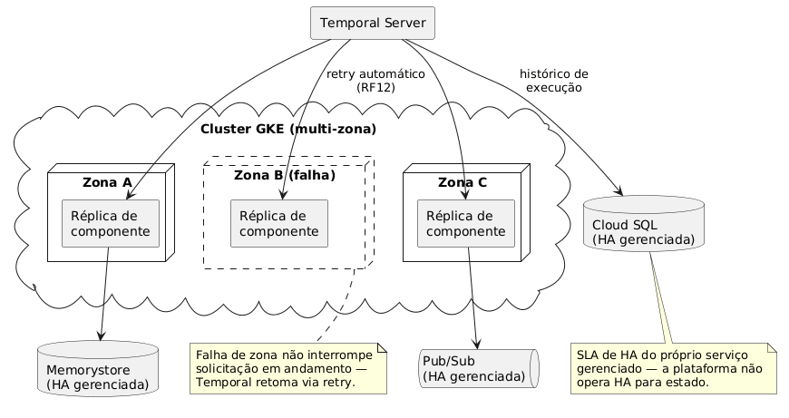

**Figura 12 – Recorte de topologia de disponibilidade multi-zona (RNF03).** Fonte: elaborado pelo autor (gerado a partir da fonte PlantUML — [doc/uml/](https://github.com/bacelarnetto/tcc-puc-minas-arquitetura-software/tree/main/doc/uml), fonte editável, ver [4.3-rnf03-disponibilidade-infra.puml](https://github.com/bacelarnetto/tcc-puc-minas-arquitetura-software/blob/main/doc/uml/4.3-rnf03-disponibilidade-infra.puml), renderizar com [render.sh](https://github.com/bacelarnetto/tcc-puc-minas-arquitetura-software/blob/main/doc/uml/render.sh)). Imagem em alta resolução: [4.3-rnf03-disponibilidade-infra.png](https://github.com/bacelarnetto/tcc-puc-minas-arquitetura-software/blob/main/doc/relatorio/diagramas/4.3-rnf03-disponibilidade-infra.png).

---

#### Cenário RNF04 — Desempenho e Escalabilidade (trade-off de custo de token)

- **Atributo de Qualidade:** Desempenho (latência) e eficiência de custo (consumo de tokens de LLM), em tensão com precisão/qualidade do parecer gerado
- **Requisito:** RNF04 — tempo entre solicitação e notificação ≤ 10 min (p95); 50 solicitações concorrentes sem degradação

##### Cenário
Se o volume de sinistros simultâneos aumentar (até 50 concorrentes), a plataforma deve concluir o processamento em até 10 minutos (p95), equilibrando custo de token e qualidade do parecer.

##### Preocupação
O custo por chamada de LLM escala com o volume de sinistros processados; usar cadeia de raciocínio (*chain-of-thought*) mais longa no MCP Host aumenta tokens de saída — logo custo e latência — mas pode reduzir erro no parecer consolidado (menos retrabalho humano, menos risco de não conformidade SUSEP)

##### Ambiente
Operação em produção, pico de 50 solicitações concorrentes (RNF04), sinistro típico com até 15 fotos e laudo de até 10 páginas — contexto volumoso enviado ao LLM

##### Estímulo
Aumento do volume de sinistros simultâneos (ex.: pico após evento climático regional) dispara múltiplas chamadas de *chat completion* concorrentes ao provedor de LLM

##### Mecanismo
(1) `LLM Provider Adapter` (seção 2.4) permite *model tiering*: modelo mais barato/rápido para *steps* mecânicos de extração/estruturação de dados, modelo com mais capacidade de raciocínio reservado à consolidação final do parecer (Report Builder); (2) cache de leitura (Memorystore/Redis) evita reconsultar a fonte (BigQuery/sistema legado) quando o mesmo dado de apólice/sinistro já foi lido no mesmo fluxo, reduzindo latência e carga no backend sob concorrência — o resultado da *tool* ainda é enviado ao LLM como contexto independentemente do cache; quem reduz tokens é o *model tiering* (item 1) e o orçamento por chamada (item 3); (3) orçamento de tokens por chamada configurável no Prompt Config Store (RF05), sem exigir mudança de código

##### Medida de resposta
Custo médio de token por sinistro dentro de orçamento definido, sem violar RNF04 (10 min p95); *throughput* de 50 concorrentes sustentado sem fila crescente

##### Considerações sobre a arquitetura

- **Pontos de Sensibilidade:** O p95 de 10 minutos é sensível à latência do provedor de LLM contratado (fila, *rate limiting*, variação natural do tempo de inferência) — uma dependência externa fora do controle direto da arquitetura, na mesma fronteira já declarada para disponibilidade (RNF03)
- **Tradeoff:** Reduzir tokens/cadeia de raciocínio barateia e acelera a chamada ao LLM, mas pode degradar a qualidade do parecer e aumentar retrabalho/risco de não conformidade SUSEP; aumentar a cadeia de raciocínio para ganhar qualidade tensiona diretamente o p95 do RNF04 — custo/latência × qualidade do parecer
- **Riscos:** A latência do provedor de LLM é uma fonte de risco ao p95 fora do controle direto da arquitetura, independentemente da escolha de modelo/tokens. Como o provedor é abstraído via `LLM Provider Adapter`, a escolha de modelo por *step* é reversível via configuração (Agent Console/RF05), sem *lock-in* de fornecedor — o que mitiga o custo de uma eventual troca, mas não elimina a variabilidade de latência em si

**Evidência textual:** o `LLM Provider Adapter` (seção 2.4, Mecanismos Arquiteturais) desacopla o Agent Orchestrator do provedor/modelo específico via `ChatClient` do Spring AI — a mesma abstração que viabiliza troca de provedor (portabilidade) também viabiliza *model tiering* por *step* do pipeline sem alteração de código, apenas configuração via Agent Console (RF05).

**Evidência em figura:** Figura 13, recorte dedicado dos dois pontos de mecanismo citados acima — o `LLM Provider Adapter` aplicando *model tiering* por step, e a `Tools API` consultando o cache de leitura no Memorystore antes de reconsultar a fonte, sem repetir o Diagrama de Container 3.2.2 completo (Figura 4).

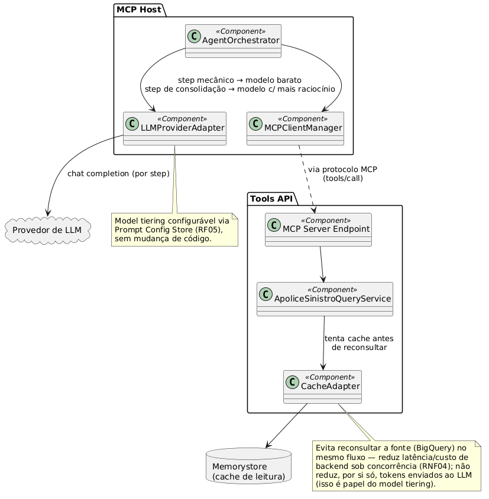

**Figura 13 – Recorte de model tiering e cache de leitura (RNF04).** Fonte: elaborado pelo autor (gerado a partir da fonte PlantUML — [doc/uml/](https://github.com/bacelarnetto/tcc-puc-minas-arquitetura-software/tree/main/doc/uml), fonte editável, ver [4.3-rnf04-model-tiering-cache.puml](https://github.com/bacelarnetto/tcc-puc-minas-arquitetura-software/blob/main/doc/uml/4.3-rnf04-model-tiering-cache.puml), renderizar com [render.sh](https://github.com/bacelarnetto/tcc-puc-minas-arquitetura-software/blob/main/doc/uml/render.sh)). Imagem em alta resolução: [4.3-rnf04-model-tiering-cache.png](https://github.com/bacelarnetto/tcc-puc-minas-arquitetura-software/blob/main/doc/relatorio/diagramas/4.3-rnf04-model-tiering-cache.png).

---

#### Cenário RNF05 — Rastreabilidade (auditabilidade ponta a ponta)

- **Atributo de Qualidade:** Rastreabilidade/Auditabilidade
- **Requisito:** RNF05 — todo parecer gerado deve ser auditável de ponta a ponta (quem solicitou, quais fontes/evidências consultadas, quando), inclusive as submissões feitas via app mobile

##### Cenário
Se um auditor solicitar o histórico completo de um sinistro, a plataforma deve permitir reconstruir a cadeia de decisão (quem solicitou, quais fontes, quando) de ponta a ponta.

##### Preocupação
Em um domínio regulado pela SUSEP, uma disputa ou auditoria de um parecer específico exige reconstruir a cadeia de decisão — quais dados foram consultados, quando, e por quem foi solicitado

##### Ambiente
Pós-processamento, uma auditoria interna ou externa (SUSEP) solicita evidência de como um parecer foi gerado

##### Estímulo
Um auditor solicita o histórico completo de um `sinistro_id` — origem da solicitação, fontes/*tools* consultadas, *timestamps*, resultado (inclusive em caminhos de erro, RF12)

##### Mecanismo
(1) o Temporal mantém histórico completo e imutável de execução do workflow (cada *activity*/chamada de *tool* registrada) na Base do Pipeline; (2) logging estruturado (SLF4J/Logback → Promtail → Loki → Grafana) correlacionado por `sinistro_id`/Workflow ID entre todos os containers da pipeline; (3) a nota sobre granularidade do status (RF14, seção 3.2.2) documenta que o nível técnico/interno (Temporal) já tem granularidade *step a step*, mesmo o Web Console expondo só status binário ao regulador/corretor; (4) dados brutos permanecem no Object Storage com chave determinística mesmo em falhas parciais (nota RF12, seção 3.2.3), preservando evidência parcial

##### Medida de resposta
Dado um `sinistro_id`, a cadeia completa (quem disparou, quais fontes/*tools* consultadas, quando, resultado) é reconstruível via Temporal Web UI/SDK combinado aos *dashboards* Grafana/Loki — nível técnico/interno, sem exigir instrumentação adicional além do já previsto na seção 2.4

##### Considerações sobre a arquitetura

- **Pontos de Sensibilidade:** O nível de rastreabilidade percebido pelo regulador é sensível à decisão de não expor o histórico *step a step* do Temporal via Web Console (nota RF14, seção 3.2.2) — a granularidade real existe internamente, mas a exposição de negócio é binária
- **Tradeoff:** Manter o Web Console com status binário (sem granularidade por *step*) simplifica a interface e é compatível com o tempo de resposta esperado (RNF04), mas limita a rastreabilidade *self-service* de negócio à auditoria técnica sob demanda — usabilidade/simplicidade × rastreabilidade de negócio
- **Riscos:** Se a SUSEP exigir rastreabilidade de negócio *self-service*, e não apenas auditoria técnica sob demanda, seria necessário expor parte do histórico via API/Console, hoje fora de escopo; o período de retenção de *logs*/histórico não foi definido neste trabalho, ponto em aberto frente a eventuais exigências regulatórias de retenção mínima. A captura do histórico técnico em si (Temporal + *logs* correlacionados por `sinistro_id`) já está garantida por desenho, independentemente de qualquer exposição futura — o risco está na exposição de negócio, não na existência do dado

**Evidência textual:** nota sobre granularidade do status (RF14, seção 3.2.2), combinada com a linha "Log do sistema" da seção 2.4 (Mecanismos Arquiteturais — SLF4J/Logback, Promtail, Loki, Grafana).

**Evidência em figura:** Figura 14, sequência dedicada mostrando o auditor reconstruindo a cadeia técnica de um `sinistro_id` por dois caminhos: histórico imutável de execução via Temporal (step a step) e logs correlacionados via Grafana/Loki.

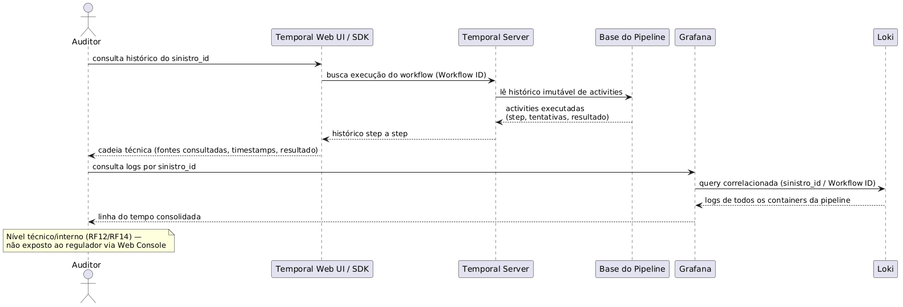

**Figura 14 – Sequência de consulta de auditoria/rastreabilidade (RNF05).** Fonte: elaborado pelo autor (gerado a partir da fonte PlantUML — [doc/uml/](https://github.com/bacelarnetto/tcc-puc-minas-arquitetura-software/tree/main/doc/uml), fonte editável, ver [4.3-rnf05-rastreabilidade.puml](https://github.com/bacelarnetto/tcc-puc-minas-arquitetura-software/blob/main/doc/uml/4.3-rnf05-rastreabilidade.puml), renderizar com [render.sh](https://github.com/bacelarnetto/tcc-puc-minas-arquitetura-software/blob/main/doc/uml/render.sh)). Imagem em alta resolução: [4.3-rnf05-rastreabilidade.png](https://github.com/bacelarnetto/tcc-puc-minas-arquitetura-software/blob/main/doc/relatorio/diagramas/4.3-rnf05-rastreabilidade.png).

---

#### Cenário RNF06 — Usabilidade e Disponibilidade Offline (mobile)

- **Atributo de Qualidade:** Usabilidade / Disponibilidade offline (mobile)
- **Requisito:** RNF06 — o aplicativo da segurada deve permitir a captura de fotos do sinistro mesmo sem conectividade, sincronizando automaticamente quando a conexão for restabelecida

##### Cenário
Se a segurada capturar fotos do sinistro sem conectividade, o aplicativo deve preservar os dados localmente e sincronizá-los automaticamente, sem perda ou duplicidade, ao reconectar.

##### Preocupação
A segurada está no local do sinistro (ex.: acidente de veículo), tipicamente com conectividade ruim ou inexistente, e precisa registrar evidências (fotos) sem perder o que já capturou

##### Ambiente
Uso em campo, Mobile App (React Native), conectividade intermitente ou ausente

##### Estímulo
A segurada tira várias fotos do dano enquanto o dispositivo está sem sinal; a conexão volta minutos ou horas depois

##### Mecanismo
(1) o app grava as fotos em fila local persistente (não só em memória) antes de qualquer tentativa de envio; (2) ao reconectar, sincroniza automaticamente via *upload* retomável/parcelado, usando URL pré-assinada (*presigned URL*) direto para o Google Cloud Storage — evitando reenviar o arquivo por múltiplos saltos da plataforma; (3) uma chave de idempotência gerada no cliente (mesmo mecanismo do ponto 2 de idempotência, seção 3.3) garante que um reenvio após reconexão não crie solicitação duplicada, já que o `sinistro_id` ainda não existe no momento da captura offline

##### Medida de resposta
Nenhuma foto capturada offline é perdida; a sincronização completa ocorre automaticamente ao reconectar, sem intervenção manual da segurada; reenvios não geram duplicidade, graças à chave de idempotência do cliente

##### Considerações sobre a arquitetura

- **Pontos de Sensibilidade:** A garantia de não perder fotos capturadas offline é sensível à persistência local ser durável (armazenamento em disco) e não apenas em memória — se essa camada falhar, a garantia do RNF06 colapsa mesmo com o resto do mecanismo correto
- **Tradeoff:** Manter uma fila local maior/mais duradoura de fotos não sincronizadas reduz o risco de perda em períodos offline longos, mas consome mais armazenamento e recursos do dispositivo — durabilidade offline × uso de recursos do aparelho da segurada
- **Riscos:** Limite de armazenamento local do dispositivo em cenários de período offline muito longo ou volume grande de fotos; o app ser finalizado/desinstalado antes da sincronização completa perderia o que não estivesse persistido de forma durável; a experiência de "status de sincronização pendente" para a usuária precisa de UI clara — ponto de UX não aprofundado neste trabalho, cujo foco é arquitetural. Já o reenvio duplicado após reconexão não é um risco em aberto: o mecanismo de *dedup* por chave de idempotência gerada no cliente (mesmo padrão do ponto 2 de idempotência, seção 3.3) já resolve esse caso

**Evidência textual:** ponto 2 de idempotência ("Envio/reenvio *self-service*", seção 3.3), combinado com o parágrafo sobre a ausência de BFF (seção 2.4), que identifica o Mobile App como o único canal com requisito distinto (RNF06, *offline-first*) coberto no nível de endpoint por *upload* retomável, URL pré-assinada e chave de idempotência no cliente.

**Evidência em figura:** Figura 15, sequência dedicada mostrando a captura offline (fila local persistente) e a sincronização automática ao reconectar (URL pré-assinada + chave de idempotência).

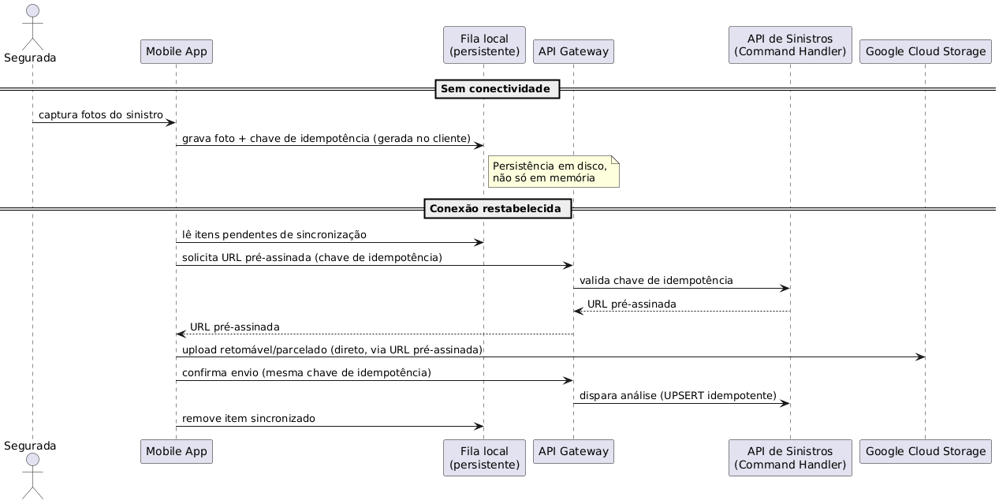

**Figura 15 – Sequência de captura offline e sincronização (RNF06).** Fonte: elaborado pelo autor (gerado a partir da fonte PlantUML — [doc/uml/](https://github.com/bacelarnetto/tcc-puc-minas-arquitetura-software/tree/main/doc/uml), fonte editável, ver [4.3-rnf06-offline-sync.puml](https://github.com/bacelarnetto/tcc-puc-minas-arquitetura-software/blob/main/doc/uml/4.3-rnf06-offline-sync.puml), renderizar com [render.sh](https://github.com/bacelarnetto/tcc-puc-minas-arquitetura-software/blob/main/doc/uml/render.sh)). Imagem em alta resolução: [4.3-rnf06-offline-sync.png](https://github.com/bacelarnetto/tcc-puc-minas-arquitetura-software/blob/main/doc/relatorio/diagramas/4.3-rnf06-offline-sync.png).

#### Riscos declarados e tratamento

Cada cenário acima declarou, no campo Riscos de suas Considerações sobre a arquitetura, pontos que extrapolam o atributo de qualidade principal daquele RNF. A tabela a seguir consolida esses riscos e o tratamento dado a cada um — não como cenários ATAM adicionais (fora do escopo de 1 cenário por RNF do CA-2.2), mas como registro explícito de que nenhum foi ignorado.

| Risco (declarado em) | Tratamento | Status |
| --- | --- | --- |
| Credencial M2M comprometida, sem estratégia de rotação/revogação (RNF01) | Reconhecido; rotação/revogação de credenciais de serviço não aprofundada — fora do escopo de modelagem arquitetural deste trabalho | Em aberto |
| RF15/RNF02 validados só ao nível de modelagem — nenhum segundo domínio real foi implementado, então o prazo de 10 dias-homem é estimativa de design, não medida (RNF02) | Reconhecido; incerteza concentrada na implementação das *tools* (varia por domínio) — a configuração via Agent Console (RF05) não exige *deploy*, então não deve estourar o prazo por si só | Em aberto |
| Indisponibilidade de uma região GCP inteira, fora do escopo dos 99,9% (RNF03) | Reconhecido; endereçado como possibilidade de continuidade futura — evoluir para topologia multi-region/multi-cluster (seção 6, Conclusão) | Parcial (direção futura declarada) |
| Variabilidade de latência do provedor de LLM, fora do controle direto da arquitetura (RNF04) | Mitigado parcialmente por *model tiering* (`LLM Provider Adapter`) e cache de leitura (Memorystore); a latência do provedor em si permanece incontrolável | Parcial |
| SUSEP exigindo rastreabilidade de negócio *self-service* (não só auditoria técnica sob demanda) (RNF05) | Reconhecido; exigiria expor parte do histórico do Temporal via API/Console — hoje fora de escopo | Em aberto |
| Período de retenção de *logs*/histórico não definido (RNF05) | Não definido neste trabalho — ponto em aberto frente a eventuais exigências regulatórias de retenção mínima | Em aberto |
| App finalizado ou desinstalado antes da sincronização completa (RNF06) | Mitigado por design para finalização do processo (fila local persistente em disco, não só em memória); desinstalação e limite de armazenamento do dispositivo permanecem como risco residual | Parcial |
| Falta de clareza de UX sobre "sincronização pendente" para a segurada (RNF06) | Não aprofundado neste trabalho — foco é arquitetural, não design de interface; ponto em aberto para uma eventual fase de design de produto | Em aberto |

---

## 5. Avaliação Crítica dos Resultados

*Quadro resumo — pontos avaliados*

| Ponto avaliado | Descrição |
| --- | --- |
| Reuso e idempotência | Decomposição hexagonal valida reuso multi-domínio (RF15); idempotência sistemática em cada ponto de retry, sem lacuna |
| Deploy/CI-CD | Definido só em nível de mecanismo (2.4); pipeline de build, versionamento e GitOps fora do escopo deste trabalho |
| Ausência de BFF | Decisão razoável hoje; Mobile App (RNF06) é o canal com maior chance de exigir um no futuro |
| Custo × latência × qualidade de IA | Trade-off estrutural (Cenário RNF04); mitigado por *model tiering*, não eliminado |
| *Database per Service* por domínio | Correção de escopo do Prompt Config Store reforçou *bounded context* sobre conveniência técnica |

A arquitetura proposta atende aos objetivos definidos na seção 1. A decomposição em containers (seção 3.2) combinada à organização interna de cada um segundo a Arquitetura Hexagonal (seção 3.3) valida, ao menos no nível de modelagem, a proposta de reutilização entre domínios de negócio (RF15): um novo domínio exigiria apenas um novo MCP Server, sem alteração do MCP Host, dentro do prazo de 10 dias-homem estabelecido pelo RNF02. A consistência na aplicação de padrões — CQRS na API de Sinistros, Publish-Subscribe na notificação, Strategy nos canais de notificação, Adapter nas integrações externas — e o tratamento sistemático de idempotência em cada ponto de reentrega (seção 3.3, nota sobre idempotência) são pontos fortes: nenhum mecanismo de retry foi deixado sem um correspondente de deduplicação, reduzindo o risco de efeito colateral duplicado — um requisito implícito, mas crítico, em um domínio regulado como seguros.

Por outro lado, alguns trade-offs foram conscientemente aceitos e merecem registro crítico. Primeiro, a decisão de deploy (Kubernetes/GKE em produção, GitHub Actions para CI/CD) foi definida apenas em nível de mecanismo arquitetural (seção 2.4), sem aprofundar o pipeline de build/deploy, estratégia de versionamento de imagem/API ou GitOps — por estar fora do escopo deste trabalho, que é modelagem arquitetural, não implementação/construção (Regulamento do Projeto Integrado, seção 2).

Segundo, optou-se por não introduzir um BFF (*Backend for Frontend*): decisão razoável para o escopo atual, já que os canais de acesso têm necessidades de dados, na maior parte, semelhantes e operações simples de disparo/consulta de status. No entanto, o Mobile App é o canal com requisito genuinamente diferente dos demais (RNF06 — offline-first, banda limitada); se no futuro ele exigir payloads mais enxutos ou agregados, a API de Sinistros compartilhada tende a acumular lógica condicional por cliente — sintoma clássico que levaria à introdução de um BFF dedicado ao mobile, não a todos os canais. Se essa evolução for adotada, o cuidado de design é não duplicar responsabilidade já resolvida em outra camada: o BFF deve se restringir a moldar *payload*, nunca reimplementar autenticação/*rate limiting* (já no API Gateway) nem recalcular status/dados que já são responsabilidade do Query Handler (CQRS) — senão cria-se uma segunda fonte de verdade.

Terceiro, o trade-off entre custo, latência e qualidade do raciocínio de IA, detalhado no Cenário RNF04 (seção 4.3), expõe uma limitação estrutural da arquitetura: o custo operacional escala com o volume de sinistros processados, e não há garantia fechada de que a redução de tokens não afete a qualidade do parecer. O `LLM Provider Adapter` mitiga o problema via *model tiering* (menos tokens por *step*), complementado pelo cache de leitura na Tools API (menos latência/carga na fonte de dados), mas não o elimina — assim como a variabilidade de latência de um provedor de LLM terceiro permanece fora do controle direto da plataforma, a mesma fronteira já assumida para a disponibilidade de terceiros no RNF03.

Por fim, a própria elaboração deste trabalho evidenciou o valor de aplicar o princípio *Database per Service* por domínio de negócio (*bounded context*), não apenas por conveniência técnica: a primeira versão da modelagem colocava Temporal Server, Init Worker e MCP Host compartilhando uma única instância de Cloud SQL. A revisão identificou que o MCP Host pertence a um domínio diferente — configuração de agentes/LLM, com dado sensível (chaves de API) — dos demais, que compartilham o domínio de execução de workflow. A correção, isolando o Prompt Config Store em instância própria (seção 2.4), reforça que fronteiras de *bounded context* devem prevalecer sobre a simples viabilidade técnica de compartilhar um recurso.

Os riscos identificados ao longo da avaliação ATAM (seção 4.3) que extrapolam o atributo de qualidade principal de cada RNF — credencial de serviço comprometida, domínio com padrão de interação não suportado, indisponibilidade regional, retenção de logs não definida, entre outros — estão consolidados na tabela "Riscos declarados e tratamento" (seção 4.3), reforçando que nenhum deles foi deixado sem registro explícito, mesmo os que permanecem em aberto.

---

## 6. Conclusão

O RelatoSeg demonstra que é possível propor uma arquitetura de referência distribuída, orquestrada por agentes de IA via protocolo MCP, capaz de automatizar a geração de relatórios analíticos a partir de dados corporativos heterogêneos e reutilizável entre diferentes áreas de negócio de uma seguradora — objetivo geral estabelecido na seção 1. A macroarquitetura foi modelada segundo o C4 model (contexto, container e componentes, seção 3); os mecanismos de integração entre orquestração de pipeline (Temporal), plataforma de agentes (MCP Host) e API de ferramentas de domínio (Tools API) foram especificados via protocolo MCP, com cada container organizado internamente segundo a Arquitetura Hexagonal (seções 2.4 e 3.3); e a arquitetura foi avaliada quanto a segurança, disponibilidade, desempenho e escalabilidade, rastreabilidade, extensibilidade e usabilidade/disponibilidade offline segundo o método ATAM (seção 4).

**Lições aprendidas:**

- **Declarar fronteiras de responsabilidade frente a dependências externas é parte da modelagem, não só da comunicação.** Tanto para disponibilidade (RNF03) quanto para desempenho/custo (RNF04), prometer cobertura sobre o que não está sob controle direto da plataforma — provedor de LLM, Google Drive, SendGrid, OneSignal — seria um erro arquitetural, não apenas uma imprecisão de texto.
- ***Database per Service* deve ser guiado por domínio de negócio (*bounded context*), não por conveniência técnica de compartilhar instância.** A correção de escopo do Prompt Config Store (seção 5), isolando-o do domínio de execução do Temporal Server/Init Worker, evidenciou isso na prática ao longo da elaboração deste trabalho.
- **Evitar abstração especulativa até haver sintoma real economiza complexidade sem custo de qualidade.** A decisão de não introduzir um BFF (seção 2.4) foi conscientemente adiada até que um canal (o Mobile App, via RNF06) apresentasse necessidade concreta e ainda não suficiente para justificar a camada extra — reforçando que YAGNI, aplicado com critério, é tão válido em arquitetura quanto em código.

Como possibilidades de continuidade futura, além das já registradas na Avaliação Crítica — introdução de um BFF dedicado ao Mobile App, caso a necessidade de *payload* enxuto se confirme; aprofundamento do pipeline de CI/CD e estratégia de versionamento/GitOps, fora do escopo deste trabalho — destacam-se: (i) evoluir o cluster GKE, hoje single-region, para uma topologia multi-region ou multi-cluster com failover automático, cobrindo cenários de indisponibilidade de uma região inteira do GCP, hoje fora do escopo do RNF03 (99,9%); e (ii) instrumentar observabilidade dedicada ao custo de tokens por sinistro processado (*dashboard* e alertas de orçamento), formalizando como métrica operacional o trade-off identificado no Cenário RNF04, hoje mitigado apenas por decisão de design (*model tiering*).

---

## Referências
- SUSEP. Circular SUSEP nº 621, de 12 de fevereiro de 2021. Dispõe sobre as regras de funcionamento e os critérios para operação das coberturas dos seguros de danos. Brasília: Diário Oficial da União, 17 fev. 2021. Disponível em: https://www.in.gov.br/en/web/dou/-/circular-susep-n-621-de-12-de-fevereiro-de-2021-303756056. Acesso em: 06 ago. 2026.
- CONJUR. A duração razoável da regulação do sinistro pela seguradora. *Consultor Jurídico*, 28 mar. 2024. Disponível em: https://www.conjur.com.br/2024-mar-28/a-duracao-razoavel-da-regulacao-do-sinistro-pela-seguradora/. Acesso em: 06 ago. 2026.
- MOBILE TIME. IA é usada por 80% das seguradoras no Brasil, diz CNSeg. *Mobile Time*, 24 fev. 2026. Disponível em: https://www.mobiletime.com.br/noticias/24/02/2026/ia-seguradoras-80-brasil/. Acesso em: 06 ago. 2026.
- ANTHROPIC. *Introducing the Model Context Protocol*. 25 nov. 2024. Disponível em: https://www.anthropic.com/news/model-context-protocol. Acesso em: 06 ago. 2026.
- BROWN, Simon. *The C4 model for visualising software architecture*. [s.d.]. Disponível em: https://c4model.com/. Acesso em: 06 ago. 2026.
- BASS, Len; CLEMENTS, Paul; KAZMAN, Rick. *Software Architecture in Practice*. 4. ed. Boston: Addison-Wesley Professional, 2021. 464 p. ISBN 978-0-13-688588-7 (e-book).
- HARDT, Dick (ed.). *The OAuth 2.0 Authorization Framework (RFC 6749)*. Internet Engineering Task Force (IETF), out. 2012. Disponível em: https://www.rfc-editor.org/info/rfc6749. Acesso em: 06 ago. 2026.
- TEMPORAL TECHNOLOGIES. *Temporal documentation: durable execution*. [s.d.]. Disponível em: https://docs.temporal.io/. Acesso em: 06 ago. 2026.
- COCKBURN, Alistair. *Hexagonal architecture*. 2005. Disponível em: https://alistair.cockburn.us/hexagonal-architecture/. Acesso em: 10 ago. 2026.

---

## Vídeo de Apresentação Final
- **Vídeo:** [apresentacao_jose_ribamar.mp4](https://drive.google.com/file/d/1wueXiD9v3bTnmqFdqe07vnkSS-Lw0Ubt/view) (Google Drive, acesso público) — também versionado em [doc/apresentacao/](https://github.com/bacelarnetto/tcc-puc-minas-arquitetura-software/blob/main/doc/apresentacao/apresentacao_jose_ribamar.mp4).
- **Slides de apoio:** [apresentacao_tcc_relatoseg](https://docs.google.com/presentation/d/1ZDmiCYIqu-REYTAPGVz5oGSv_q14boo6BFqBhST_djU/edit?usp=sharing) — também versionado em [doc/apresentacao/](https://github.com/bacelarnetto/tcc-puc-minas-arquitetura-software/blob/main/doc/apresentacao/apresentacao_tcc_relatoseg.pptx).
